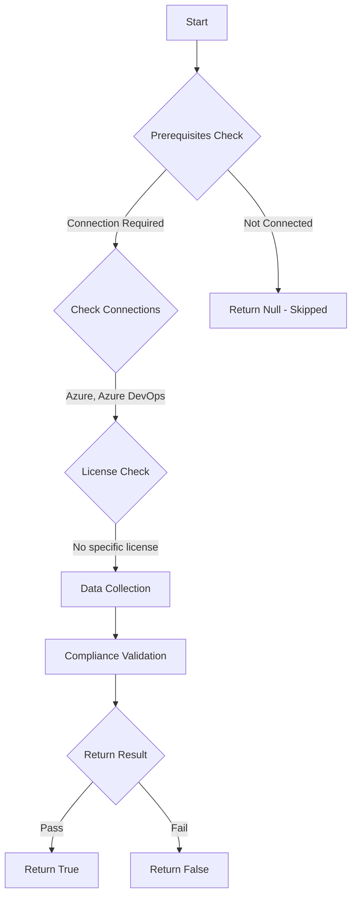

# Test-AzdoOrganizationProtectAccessToRepository: Returns a boolean depending on the configuration.

## Overview

**Function Name:** `Test-AzdoOrganizationProtectAccessToRepository`
**Category:** Maester/AzureDevOps

## Description

Checks if checks and approvals are applied when accessing repositories from YAML pipelines.
    Also, generate a job access token that is scoped to repositories that are explicitly referenced in the YAML pipeline.

    https://learn.microsoft.com/en-us/azure/devops/pipelines/security/overview?view=azure-devops#restrict-project-repository-and-service-connection-access

## Workflow

## Phase Details

### Phase 1: Prerequisites Check

**Required Connections:**
- Azure
- Azure DevOps

### Phase 2: Data Collection

**Cmdlets/Functions Used:**
- `Get-ADOPSOrganizationPipelineSettings`

### Phase 3: Compliance Validation

The function validates the collected data against compliance requirements.

### Phase 4: Return Result

| Return Value | Meaning |
| --- | --- |
| `$true` | Compliant |
| `$false` | Non-Compliant |
| `$null` | Skipped (missing prerequisites, license, or error) |

## Original Documentation

Access to repositories in YAML pipelines should apply checks and approval before granting access.

Rationale: To enhance security, consider separating your projects, using branch policies, and adding more security measures for forks. Minimize the scope of service connections and use the most secure authentication methods.

#### Remediation action:
Enable the policy to apply checks and approvals.
1. Sign in to your organization.
2. Choose Organization settings.
3. Under the Pipelines section choose Settings.
4. In the General section, toggle on "Protect access to repositories in YAML pipelines".

**Results:**
Apply checks and approvals when accessing repositories from YAML pipelines. Also, generate a job access token that is scoped to repositories that are explicitly referenced in the YAML pipeline.

#### Related links

* [Learn - Restrict project, repository, and service connection access](https://learn.microsoft.com/en-us/azure/devops/pipelines/security/overview?view=azure-devops#restrict-project-repository-and-service-connection-access)

## Standalone Function

See the standalone compliance check function: [`Test-AzdoOrganizationProtectAccessToRepositoryCompliance.ps1`](../../standalone-functions/Maester/AzureDevOps/Test-AzdoOrganizationProtectAccessToRepositoryCompliance.ps1)
