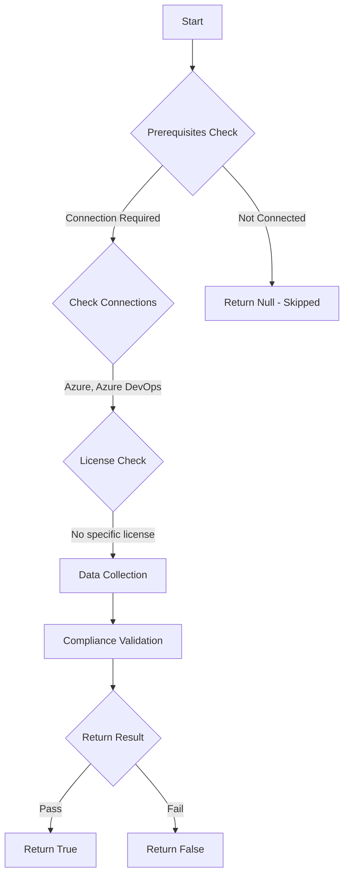

# Test-AzdoOrganizationRepositorySettingsDisableCreationTFVCRepo: Returns a boolean depending on the configuration.

## Overview

**Function Name:** `Test-AzdoOrganizationRepositorySettingsDisableCreationTFVCRepo`
**Category:** Maester/AzureDevOps

## Description

Checks the status if creation of Team Foundation Version Control (TFVC) repositories is disabled.

    https://learn.microsoft.com/en-us/azure/devops/release-notes/roadmap/2024/no-tfvc-in-new-projects

## Workflow

## Phase Details

### Phase 1: Prerequisites Check

**Required Connections:**
- Azure
- Azure DevOps

### Phase 2: Data Collection

**Cmdlets/Functions Used:**
- `Get-ADOPSOrganizationRepositorySettings`

### Phase 3: Compliance Validation

The function validates the collected data against compliance requirements.

### Phase 4: Return Result

| Return Value | Meaning |
| --- | --- |
| `$true` | Compliant |
| `$false` | Non-Compliant |
| `$null` | Skipped (missing prerequisites, license, or error) |

## Original Documentation

Creation of Team Foundation Version Control (TFVC) repositories **should be** disabled.

Rationale: Over the past several years, we added no new features to Team Foundation Version Control (TFVC). Git is the preferred version control system in Azure Repos. Furthermore, all the improvements we made in the past few years in terms of security, performance, and accessibility were only made to Git repositories.

#### Remediation action:
Enable the policy to disable the creation of TFVC repositories.
1. Sign in to your organization.
2. Choose Organization settings.
3. Under the Repos section choose Repositories.
4. In the All Repositories Settings section, toggle on "Disable creation of TFVC repositories".

**Results:**
Disable creation of TFVC repositories. You can still see and work on TFVC repositories created before.

#### Related links

* [Learn - Removal of TFVC in new projects](https://learn.microsoft.com/en-us/azure/devops/release-notes/roadmap/2024/no-tfvc-in-new-projects)

## Standalone Function

See the standalone compliance check function: [`Test-AzdoOrganizationRepositorySettingsDisableCreationTFVCRepoCompliance.ps1`](../../standalone-functions/Maester/AzureDevOps/Test-AzdoOrganizationRepositorySettingsDisableCreationTFVCRepoCompliance.ps1)
