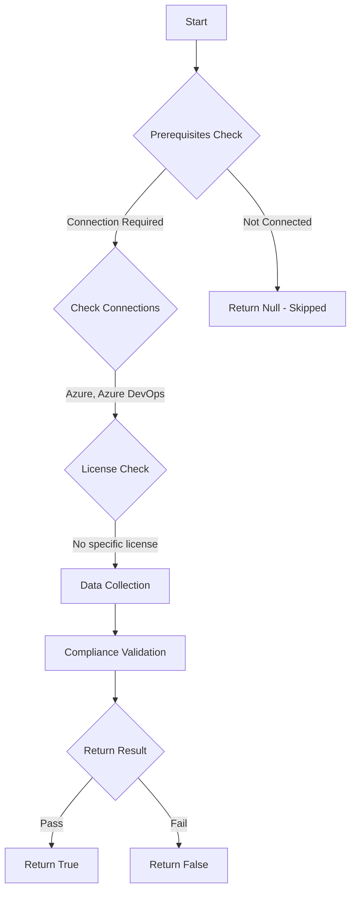

# Test-AzdoOrganizationRepositorySettingsGravatarImage: Returns a boolean depending on the configuration.

## Overview

**Function Name:** `Test-AzdoOrganizationRepositorySettingsGravatarImage`
**Category:** Maester/AzureDevOps

## Description

Checks the status if Gravatar images are shown for users outside of your enterprise.

    https://learn.microsoft.com/en-us/azure/devops/repos/git/repository-settings?view=azure-devops&tabs=browser#gravatar-images

## Workflow

## Phase Details

### Phase 1: Prerequisites Check

**Required Connections:**
- Azure
- Azure DevOps

### Phase 2: Data Collection

**Cmdlets/Functions Used:**
- `Get-ADOPSOrganizationRepositorySettings`

### Phase 3: Compliance Validation

The function validates the collected data against compliance requirements.

### Phase 4: Return Result

| Return Value | Meaning |
| --- | --- |
| `$true` | Compliant |
| `$false` | Non-Compliant |
| `$null` | Skipped (missing prerequisites, license, or error) |

## Original Documentation

Gravatar images should not be exposed for users outside your enterprise.

Rationale: Gravatar images are served by an external service (gravatar.com) and may leak email hashes or profile information. Allowing them can reveal internal usernames or identities to outside observers and increases privacy risk.

#### Remediation action:
Disable the policy to stop these requests and notifications.
1. On your Azure DevOps organization page, select Organization settings at lower left, and then select Repositories in the left navigation.
2. On the All Repositories page, set Gravatar images to Off.

**Results:**
With the setting disabled, user avatars use generic initials or local images only, preventing any information from being fetched from third-party servers.

#### Related links

* [Learn - Gravatar images](https://learn.microsoft.com/en-us/azure/devops/repos/git/repository-settings?view=azure-devops&tabs=browser#gravatar-images)

## Standalone Function

See the standalone compliance check function: [`Test-AzdoOrganizationRepositorySettingsGravatarImageCompliance.ps1`](../../standalone-functions/Maester/AzureDevOps/Test-AzdoOrganizationRepositorySettingsGravatarImageCompliance.ps1)
