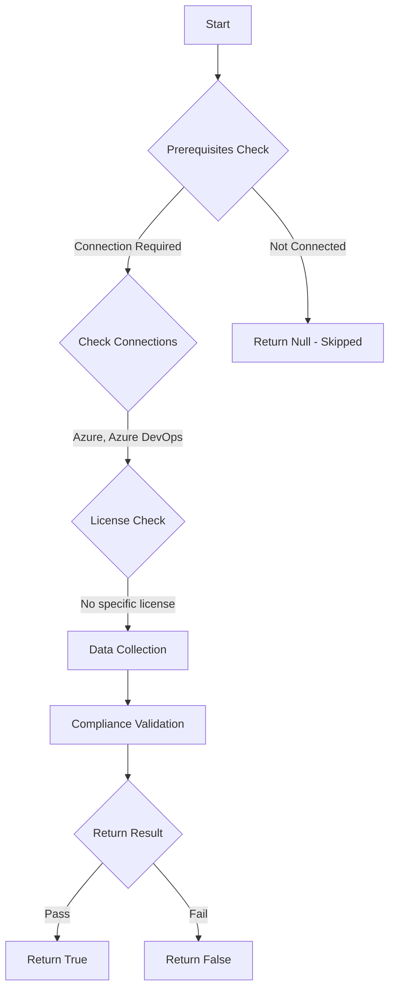

# Test-AzdoOrganizationStageChooser: Returns a boolean depending on the configuration.

## Overview

**Function Name:** `Test-AzdoOrganizationStageChooser`
**Category:** Maester/AzureDevOps

## Description

Checks the status if users are able to choose what stages to run or skip.

    https://learn.microsoft.com/en-us/azure/devops/pipelines/process/stages?view=azure-devops&tabs=yaml
    https://learn.microsoft.com/en-us/azure/devops/pipelines/security/overview?view=azure-devops

## Workflow

## Phase Details

### Phase 1: Prerequisites Check

**Required Connections:**
- Azure
- Azure DevOps

### Phase 2: Data Collection

**Cmdlets/Functions Used:**
- `Get-ADOPSOrganizationPipelineSettings`

### Phase 3: Compliance Validation

The function validates the collected data against compliance requirements.

### Phase 4: Return Result

| Return Value | Meaning |
| --- | --- |
| `$true` | Compliant |
| `$false` | Non-Compliant |
| `$null` | Skipped (missing prerequisites, license, or error) |

## Original Documentation

Users should not be able to skip stages defined by the pipeline author.

Rationale: Users should not be able to select stages to skip from the Queue Pipeline panel.

#### Remediation action:
Enable the restriction to prevent users from skipping stages.
1. Sign in to your organization.
2. Choose Organization settings.
3. Select Settings under Pipelines, locate the "Disable stage chooser" policy and toggle it to on.

#### Related links

* [Learn - Stages](https://learn.microsoft.com/en-us/azure/devops/pipelines/process/stages?view=azure-devops&tabs=yaml)
* [Learn - Azure DevOps pipeline security](https://learn.microsoft.com/en-us/azure/devops/pipelines/security/overview?view=azure-devops)

## Standalone Function

See the standalone compliance check function: [`Test-AzdoOrganizationStageChooserCompliance.ps1`](../../standalone-functions/Maester/AzureDevOps/Test-AzdoOrganizationStageChooserCompliance.ps1)
