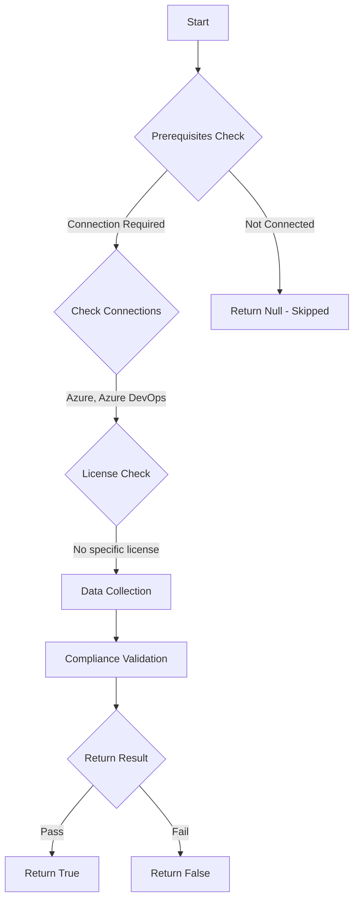

# Test-AzdoOrganizationStorageUsage: Returns a boolean depending on the configuration.

## Overview

**Function Name:** `Test-AzdoOrganizationStorageUsage`
**Category:** Maester/AzureDevOps

## Description

Checks the status of Azure Artifacts storage, Azure DevOps provides 2 GiB of free storage for each organization.
    Once your organization reaches the maximum storage limit, you won't be able to publish new artifacts.
    To continue, you can either delete some of your existing artifacts or increase your storage limit.

    https://learn.microsoft.com/en-us/azure/devops/artifacts/how-to/delete-and-recover-packages?view=azure-devops&tabs=nuget#delete-packages-automatically-with-retention-policies
    https://learn.microsoft.com/en-us/azure/devops/organizations/billing/set-up-billing-for-your-organization-vs?view=azure-devops#set-up-billing
    https://learn.microsoft.com/en-us/azure/devops/artifacts/reference/limits?view=azure-devops

## Workflow

## Phase Details

### Phase 1: Prerequisites Check

**Required Connections:**
- Azure
- Azure DevOps

### Phase 2: Data Collection

**Cmdlets/Functions Used:**
- `Get-ADOPSOrganizationCommerceMeterUsage`

### Phase 3: Compliance Validation

The function validates the collected data against compliance requirements.

### Phase 4: Return Result

| Return Value | Meaning |
| --- | --- |
| `$true` | Compliant |
| `$false` | Non-Compliant |
| `$null` | Skipped (missing prerequisites, license, or error) |

## Original Documentation

Azure Artifacts provides 2 GiB of free storage for each organization. Once your organization reaches the maximum storage limit, you will not be able to publish new artifacts. To continue, you can either delete some of your existing artifacts or increase your storage limit.

Rationale: The storage limit should not be reached; hitting it blocks artifact publication.

#### Remediation action:
- [Configure retention policies](https://learn.microsoft.com/en-us/azure/devops/artifacts/how-to/delete-and-recover-packages?view=azure-devops&tabs=nuget#delete-packages-automatically-with-retention-policies)
- [Set up billing](https://learn.microsoft.com/en-us/azure/devops/organizations/billing/set-up-billing-for-your-organization-vs?view=azure-devops#set-up-billing)
- Increase Artifacts storage limit
  - [Set up billing for your organization.](https://learn.microsoft.com/en-us/azure/devops/organizations/billing/set-up-billing-for-your-organization-vs?view=azure-devops#set-up-billing)
  - Sign in to your Azure DevOps organization, select Organization settings > Billing, and select No limit, pay for what you use from the Usage limit dropdown.
  - Select Save when you are done.

#### Related links

* [Learn - Package size and count limits](https://learn.microsoft.com/en-us/azure/devops/artifacts/reference/limits?view=azure-devops)

## Standalone Function

See the standalone compliance check function: [`Test-AzdoOrganizationStorageUsageCompliance.ps1`](../../standalone-functions/Maester/AzureDevOps/Test-AzdoOrganizationStorageUsageCompliance.ps1)
