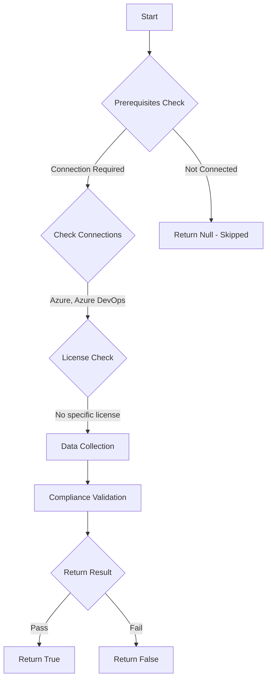

# Test-AzdoOrganizationTaskRestrictionsDisableMarketplaceTask: Returns a boolean depending on the configuration.

## Overview

**Function Name:** `Test-AzdoOrganizationTaskRestrictionsDisableMarketplaceTask`
**Category:** Maester/AzureDevOps

## Description

Checks the ability to install and run tasks from the Marketplace, which gives you greater control over the code that executes in a pipeline.

    https://learn.microsoft.com/en-us/azure/devops/pipelines/security/overview?view=azure-devops#prevent-malicious-code-execution

## Workflow

## Phase Details

### Phase 1: Prerequisites Check

**Required Connections:**
- Azure
- Azure DevOps

### Phase 2: Data Collection

**Cmdlets/Functions Used:**
- `Get-ADOPSOrganizationPipelineSettings`

### Phase 3: Compliance Validation

The function validates the collected data against compliance requirements.

### Phase 4: Return Result

| Return Value | Meaning |
| --- | --- |
| `$true` | Compliant |
| `$false` | Non-Compliant |
| `$null` | Skipped (missing prerequisites, license, or error) |

## Original Documentation

Disable the ability to install and run tasks from the Marketplace, which gives you greater control over the code that executes in a pipeline.

Rationale: Tasks from the marketplace should be reviewed and approved.

#### Remediation action:
Enable the restriction to prevent marketplace tasks from executing in pipelines.
1. Sign in to your organization.
2. Choose Organization settings.
3. Select Settings under Pipelines.
4. Go to the section "Task restrictions" and turn on "Disable marketplace tasks"

**Results:**
With this enabled, pipelines will not use tasks installed from the Marketplace. Jobs which depend on Marketplace tasks will fail.

#### Related links

* [Learn - Prevent malicious code execution](https://learn.microsoft.com/en-us/azure/devops/pipelines/security/overview?view=azure-devops#prevent-malicious-code-execution)

## Standalone Function

See the standalone compliance check function: [`Test-AzdoOrganizationTaskRestrictionsDisableMarketplaceTaskCompliance.ps1`](../../standalone-functions/Maester/AzureDevOps/Test-AzdoOrganizationTaskRestrictionsDisableMarketplaceTaskCompliance.ps1)
