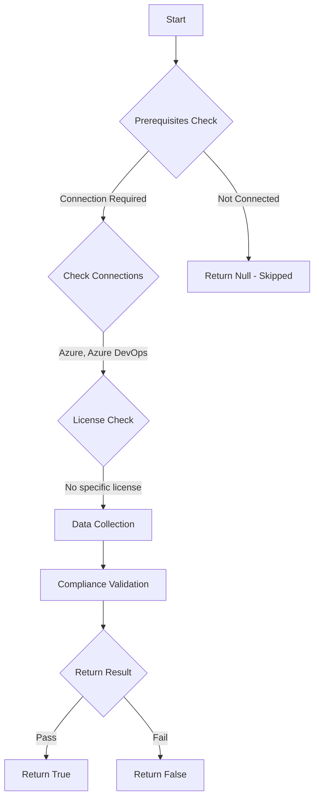

# Test-AzdoOrganizationTaskRestrictionsDisableNode6Task: Returns a boolean depending on the configuration.

## Overview

**Function Name:** `Test-AzdoOrganizationTaskRestrictionsDisableNode6Task`
**Category:** Maester/AzureDevOps

## Description

Checks the status if Node 6 is allowed on hosted agents.

    https://learn.microsoft.com/en-us/azure/devops/pipelines/security/overview?view=azure-devops#prevent-malicious-code-execution
    https://learn.microsoft.com/en-us/azure/devops/release-notes/roadmap/2022/no-node-6-on-hosted-agents

## Workflow

## Phase Details

### Phase 1: Prerequisites Check

**Required Connections:**
- Azure
- Azure DevOps

### Phase 2: Data Collection

**Cmdlets/Functions Used:**
- `Get-ADOPSOrganizationPipelineSettings`

### Phase 3: Compliance Validation

The function validates the collected data against compliance requirements.

### Phase 4: Return Result

| Return Value | Meaning |
| --- | --- |
| `$true` | Compliant |
| `$false` | Non-Compliant |
| `$null` | Skipped (missing prerequisites, license, or error) |

## Original Documentation

Disable Node 6 tasks.

Rationale: Node.js 6 reached end-of-life in April 2019 and no longer receives security patches. Pipeline tasks that use the Node 6 execution handler run on an unpatched, unsupported runtime, which may expose the pipeline to known vulnerabilities.

#### Remediation action:
Enable the restriction to prevent Node 6 tasks from executing in pipelines.
1. Sign in to your organization.
2. Choose Organization settings.
3. Select Settings under Pipelines.
4. Go to the section "Task restrictions" and turn on "Disable Node 6 tasks"

**Results:**
With this enabled, pipelines will fail if they utilize a task with a Node 6 execution handler.

#### Related links

* [Learn - Prevent malicious code execution](https://learn.microsoft.com/en-us/azure/devops/pipelines/security/overview?view=azure-devops#prevent-malicious-code-execution)
* [Learn - Remove Node 6 and Node 10 runners from Microsoft-hosted agents](https://learn.microsoft.com/en-us/azure/devops/release-notes/roadmap/2022/no-node-6-on-hosted-agents)

## Standalone Function

See the standalone compliance check function: [`Test-AzdoOrganizationTaskRestrictionsDisableNode6TaskCompliance.ps1`](../../standalone-functions/Maester/AzureDevOps/Test-AzdoOrganizationTaskRestrictionsDisableNode6TaskCompliance.ps1)
