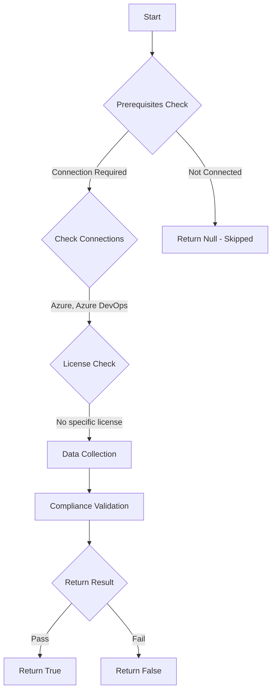

# Test-AzdoOrganizationTaskRestrictionsShellTaskArgumentValidation: Returns a boolean depending on the configuration.

## Overview

**Function Name:** `Test-AzdoOrganizationTaskRestrictionsShellTaskArgumentValidation`
**Category:** Maester/AzureDevOps

## Description

Checks the status if the Enable shell tasks arguments validation setting that validates argument parameters for built-in shell tasks to check for inputs that can inject commands into scripts.
    The check ensures that the shell correctly executes characters like semicolons, quotes, and parentheses.

    https://learn.microsoft.com/en-us/azure/devops/pipelines/security/inputs?view=azure-devops#shellTasksValidation

## Workflow

## Phase Details

### Phase 1: Prerequisites Check

**Required Connections:**
- Azure
- Azure DevOps

### Phase 2: Data Collection

**Cmdlets/Functions Used:**
- `Get-ADOPSOrganizationPipelineSettings`

### Phase 3: Compliance Validation

The function validates the collected data against compliance requirements.

### Phase 4: Return Result

| Return Value | Meaning |
| --- | --- |
| `$true` | Compliant |
| `$false` | Non-Compliant |
| `$null` | Skipped (missing prerequisites, license, or error) |

## Original Documentation

Enable Shell Task Validation to prevent code injection.

Rationale: Code injection through arguments parameters should be prevented.

#### Remediation action:
Enable the policy to stop these requests and notifications.
1. Sign in to your organization.
2. Choose Organization settings.
3. Select Settings under Pipelines.
4. Go to the section "Task restrictions" and turn on "Enable shell tasks arguments validation"

**Results:**
This validation applies to the arguments parameter in the following specific tasks:
- PowerShell
- BatchScript
- Bash
- Ssh
- AzureFileCopy
- WindowsMachineFileCopy

#### Related links

* [Learn - Shell Tasks Validation](https://learn.microsoft.com/en-us/azure/devops/pipelines/security/inputs?view=azure-devops#shellTasksValidation)

## Standalone Function

See the standalone compliance check function: [`Test-AzdoOrganizationTaskRestrictionsShellTaskArgumentValidationCompliance.ps1`](../../standalone-functions/Maester/AzureDevOps/Test-AzdoOrganizationTaskRestrictionsShellTaskArgumentValidationCompliance.ps1)
