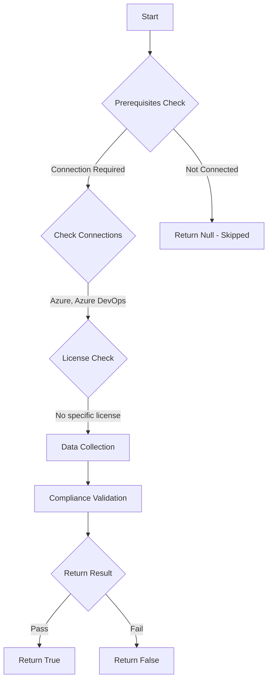

# Test-AzdoOrganizationTriggerPullRequestGitHubRepository: Returns a boolean depending on the configuration.

## Overview

**Function Name:** `Test-AzdoOrganizationTriggerPullRequestGitHubRepository`
**Category:** Maester/AzureDevOps

## Description

Checks the status if Azure Pipelines can automatically build and validate every pull request and commit to your GitHub repository.

    https://learn.microsoft.com/en-us/azure/devops/pipelines/repos/github?view=azure-devops&tabs=yaml#validate-contributions-from-forks

## Workflow

## Phase Details

### Phase 1: Prerequisites Check

**Required Connections:**
- Azure
- Azure DevOps

### Phase 2: Data Collection

**Cmdlets/Functions Used:**
- `Get-ADOPSOrganizationPipelineSettings`

### Phase 3: Compliance Validation

The function validates the collected data against compliance requirements.

### Phase 4: Return Result

| Return Value | Meaning |
| --- | --- |
| `$true` | Compliant |
| `$false` | Non-Compliant |
| `$null` | Skipped (missing prerequisites, license, or error) |

## Original Documentation

Azure DevOps pipelines should not automatically build on every pull request and commit from a GitHub repository.

Rationale: Code should not be automatically built from GitHub.

#### Remediation action:
Enable the policy to stop building from GitHub repositories.
1. Sign in to your organization.
2. Choose Organization settings.
3. Select Settings under Pipelines.
4. Go to the section "Triggers" and turn on "Limit building pull requests from forked GitHub repositories"

#### Related links

* [Learn - Validate contributions from forks](https://learn.microsoft.com/en-us/azure/devops/pipelines/repos/github?view=azure-devops&tabs=yaml#validate-contributions-from-forks)

## Standalone Function

See the standalone compliance check function: [`Test-AzdoOrganizationTriggerPullRequestGitHubRepositoryCompliance.ps1`](../../standalone-functions/Maester/AzureDevOps/Test-AzdoOrganizationTriggerPullRequestGitHubRepositoryCompliance.ps1)
