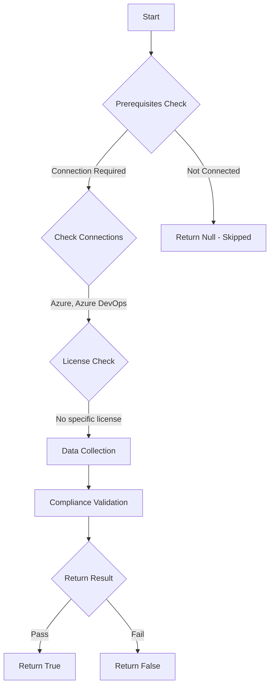

# Test-AzdoProjectCollectionAdministrator: Returns a list of all Project Collection Administrators.

## Overview

**Function Name:** `Test-AzdoProjectCollectionAdministrator`
**Category:** Maester/AzureDevOps

## Description

Checks the status of how many Project Collection Administrators that are assigned to your Azure DevOps organisation.

    https://learn.microsoft.com/en-us/azure/devops/organizations/security/about-permissions?view=azure-devops&tabs=preview-page#permissions

## Workflow

## Phase Details

### Phase 1: Prerequisites Check

**Required Connections:**
- Azure
- Azure DevOps

### Phase 2: Data Collection

**Cmdlets/Functions Used:**
- `Get-NestedAdoMembership`
- `Get-ADOPSMembership`
- `Get-ADOPSGroup`

### Phase 3: Compliance Validation

**Properties Checked:**

| Property | Expected Value |
| --- | --- |
| `subjectKind` | `group` |

### Phase 4: Return Result

| Return Value | Meaning |
| --- | --- |
| `$true` | Compliant |
| `$false` | Non-Compliant |
| `$null` | Skipped (missing prerequisites, license, or error) |

## Original Documentation

Project Collection Administrator is a highly privileged role, and membership should be restricted and regularly reviewed.

Rationale: Project Collection Administrators (PCAs) have unrestricted control over the Azure DevOps organization or collection. A compromised PCA account or an overly broad roster can lead to:
- Unapproved project creation or deletion
- Policy changes that weaken security
- Uncontrolled access to code, pipelines, and artifacts
- Configuration of billing or extensions that impact cost and service availability
Keeping the PCA group small and audited reduces the blast radius of insider threats and accidental misconfiguration.

#### Remediation action:
Restrict membership of the Project Collection Administrators group to only those individuals who absolutely require it. Periodically review the list and remove any stale accounts.

Implement privileged access management (PAM) or just-in-time access workflows so that high-privilege membership is temporary and audited. Use multifactor authentication and strong account hygiene for PCA accounts.

**Results:**
A small, well-managed PCA group reduces the risk of malicious or accidental changes and makes post-incident investigation simpler.

#### Related links

* [Learn - Azure DevOps Permissions](https://learn.microsoft.com/en-us/azure/devops/organizations/security/about-permissions?view=azure-devops&tabs=preview-page#permissions)

## Standalone Function

See the standalone compliance check function: [`Test-AzdoProjectCollectionAdministratorCompliance.ps1`](../../standalone-functions/Maester/AzureDevOps/Test-AzdoProjectCollectionAdministratorCompliance.ps1)
