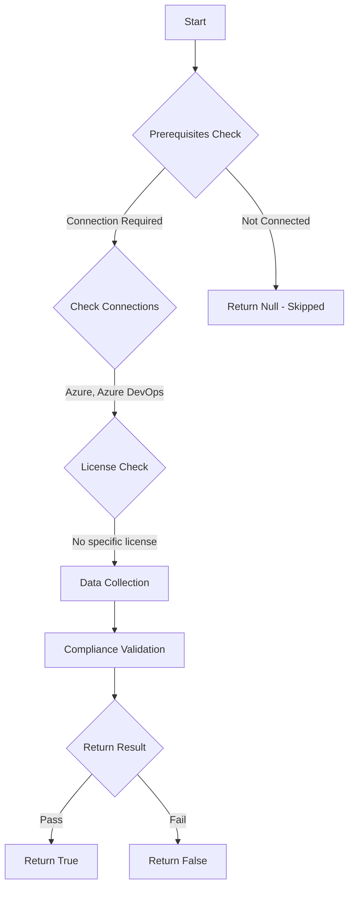

# Test-AzdoPublicProject: Returns a boolean depending on the configuration.

## Overview

**Function Name:** `Test-AzdoPublicProject`
**Category:** Maester/AzureDevOps

## Description

Checks the status of public projects within your Azure DevOps Organization.

    https://aka.ms/vsts-anon-access
    https://learn.microsoft.com/en-us/azure/devops/organizations/projects/make-project-public?view=azure-devops

## Workflow

## Phase Details

### Phase 1: Prerequisites Check

**Required Connections:**
- Azure
- Azure DevOps

### Phase 2: Data Collection

**Cmdlets/Functions Used:**
- `Get-ADOPSOrganizationPolicy`

### Phase 3: Compliance Validation

The function validates the collected data against compliance requirements.

### Phase 4: Return Result

| Return Value | Meaning |
| --- | --- |
| `$true` | Compliant |
| `$false` | Non-Compliant |
| `$null` | Skipped (missing prerequisites, license, or error) |

## Original Documentation

Public projects **should be** disabled.

Rationale: When you choose public visibility, anyone on the internet can view your project. With private visibility, only users you give access to can view your project.

#### Remediation action:
Disable the policy to stop these requests and notifications.
1. Sign in to your organization.
2. Choose Organization settings.
3. Select Policies under the Security section
4. Locate the "Allow public projects" policy and toggle it to off.

**Results:**
External users are not able to access your project.

#### Related links

* [Learn - Public projects](https://aka.ms/vsts-anon-access)
* [Learn - Change project to public or private](https://learn.microsoft.com/en-us/azure/devops/organizations/projects/make-project-public?view=azure-devops)

## Standalone Function

See the standalone compliance check function: [`Test-AzdoPublicProjectCompliance.ps1`](../../standalone-functions/Maester/AzureDevOps/Test-AzdoPublicProjectCompliance.ps1)
