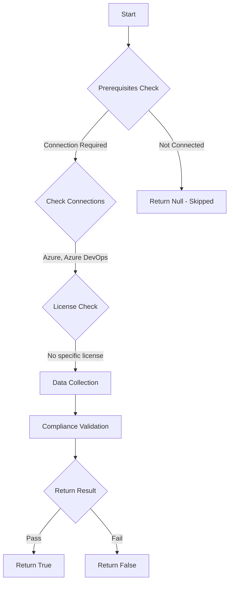

# Test-AzdoResourceUsageProject: Returns a boolean depending on the configuration.

## Overview

**Function Name:** `Test-AzdoResourceUsageProject`
**Category:** Maester/AzureDevOps

## Description

Checks the status of limitation regarding projects in Azure DevOps, As it supports up to 1,000 projects within an organization

    https://learn.microsoft.com/en-us/azure/devops/organizations/projects/about-projects?view=azure-devops

## Workflow

## Phase Details

### Phase 1: Prerequisites Check

**Required Connections:**
- Azure
- Azure DevOps

### Phase 2: Data Collection

**Cmdlets/Functions Used:**
- `Get-ADOPSResourceUsage`

### Phase 3: Compliance Validation

The function validates the collected data against compliance requirements.

### Phase 4: Return Result

| Return Value | Meaning |
| --- | --- |
| `$true` | Compliant |
| `$false` | Non-Compliant |
| `$null` | Skipped (missing prerequisites, license, or error) |

## Original Documentation

Azure DevOps supports up to 1,000 projects within an organization.

Rationale: Each project consumes metadata, service endpoints, pipelines, and storage. Maintaining a large number of rarely used or abandoned projects can increase management overhead and may impact organization performance or hit the hard limit.

#### Remediation action:
Regularly audit your project list and retire, archive, or consolidate projects that are no longer active. Consider using areas/teams within existing projects instead of creating new ones when possible.

**Results:**
Keeping your project count well below the limit prevents service errors and keeps the organization easier to govern.

#### Related links

* [Learn - About projects and scaling your organization](https://learn.microsoft.com/en-us/azure/devops/organizations/projects/about-projects?view=azure-devops)

## Standalone Function

See the standalone compliance check function: [`Test-AzdoResourceUsageProjectCompliance.ps1`](../../standalone-functions/Maester/AzureDevOps/Test-AzdoResourceUsageProjectCompliance.ps1)
