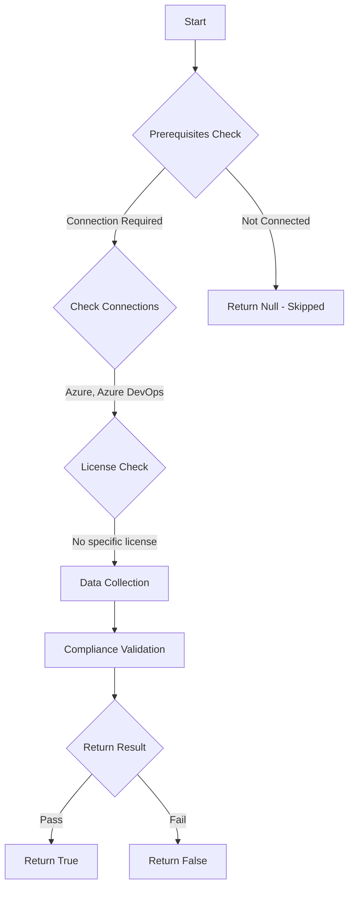

# Test-AzdoResourceUsageWorkItemTag: Returns a boolean depending on the configuration.

## Overview

**Function Name:** `Test-AzdoResourceUsageWorkItemTag`
**Category:** Maester/AzureDevOps

## Description

Checks the status of the usage of tag definitions in Azure DevOps, as Azure DevOps supports up to 150,000 tag definitions per organization or collection.

    https://learn.microsoft.com/en-us/azure/devops/organizations/settings/work/object-limits?view=azure-devops

## Workflow

## Phase Details

### Phase 1: Prerequisites Check

**Required Connections:**
- Azure
- Azure DevOps

### Phase 2: Data Collection

**Cmdlets/Functions Used:**
- `Get-ADOPSResourceUsage`

### Phase 3: Compliance Validation

The function validates the collected data against compliance requirements.

### Phase 4: Return Result

| Return Value | Meaning |
| --- | --- |
| `$true` | Compliant |
| `$false` | Non-Compliant |
| `$null` | Skipped (missing prerequisites, license, or error) |

## Original Documentation

Azure DevOps supports up to 150,000 tag definitions per organization or collection.

Rationale: Tags are useful for categorizing and querying work items, but an excessive number of unique tags can degrade performance and make management difficult. Hitting the limit may prevent users from creating new tags and could cause UI slowdowns.

#### Remediation action:
Regularly review your tag inventory and delete unused or obsolete tags. Consider standardizing on a controlled vocabulary or using area/iteration paths when appropriate.

**Results:**
Keeping the tag count below the limit ensures responsive work item searches and avoids hitting a hard cap that would block new tags.

#### Related links

* [Learn - Work tracking, process, and project limits](https://learn.microsoft.com/en-us/azure/devops/organizations/settings/work/object-limits?view=azure-devops)

## Standalone Function

See the standalone compliance check function: [`Test-AzdoResourceUsageWorkItemTagCompliance.ps1`](../../standalone-functions/Maester/AzureDevOps/Test-AzdoResourceUsageWorkItemTagCompliance.ps1)
