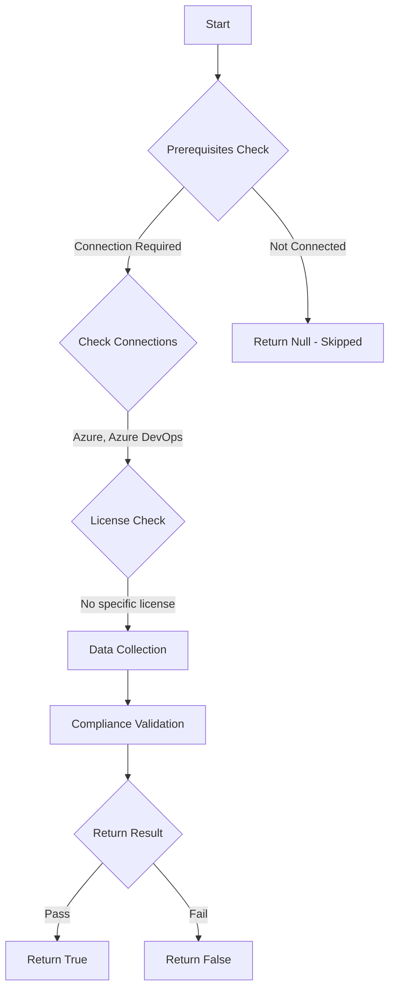

# Test-AzdoRestrictFullScopePersonalAccessToken: Returns a boolean depending on the configuration.

## Overview

**Function Name:** `Test-AzdoRestrictFullScopePersonalAccessToken`
**Category:** Maester/AzureDevOps

## Description

Checks if Personal Access Token full scope restrictions are configured.

    https://learn.microsoft.com/en-us/azure/devops/organizations/accounts/manage-pats-with-policies-for-administrators?view=azure-devops#restrict-full-scope-personal-access-tokens

## Workflow

## Phase Details

### Phase 1: Prerequisites Check

**Required Connections:**
- Azure
- Azure DevOps

### Phase 2: Data Collection

**Cmdlets/Functions Used:**
- `Get-ADOPSTenantPolicy`

### Phase 3: Compliance Validation

The function validates the collected data against compliance requirements.

### Phase 4: Return Result

| Return Value | Meaning |
| --- | --- |
| `$true` | Compliant |
| `$false` | Non-Compliant |
| `$null` | Skipped (missing prerequisites, license, or error) |

## Original Documentation

Restrict creation of full-scoped Personal Access Tokens (PATs) **should be** enabled.

#### Prerequisites

- Your organization must be linked to a Microsoft Entra tenant.
- You must be an Azure DevOps Administrator to configure tenant policies.

#### Rationale

Restricting full-scoped Personal Access Token (PAT) creation enforces least
privilege, reduces the risk of credential exposure, and limits the blast radius
if a token is compromised. It also helps meet compliance requirements and
prevents accidental or malicious use of overly permissive tokens.

#### Remediation action

Enable the tenant policy to restrict creation of full-scoped personal access tokens.
1. Sign in to your organization (https://dev.azure.com/{yourorganization}).
2. Select Organization settings (gear icon).
3. Select Microsoft Entra, find the "Restrict creation of full-scoped personal access tokens" policy.
4. Move the toggle to On.

#### Allowlist and exceptions

- Use Microsoft Entra groups for allowlists; adding named users can create identity residency concerns.
- Users or groups on the allowlist are exempt from the restriction and can create PATs of any scope.

**Existing PATs:**

Existing PATs remain valid until their configured expiration date and are not retroactively restricted.

**Results:**

When enabled, new personal access tokens (PATs) must have limited, defined
scopes. Creation of full-scope PATs (tokens that grant all accessible scopes)
will be blocked for users who are not on the allowlist.

#### Related links

* [Learn - Restrict creation of full-scoped PATs (tenant policy)](https://learn.microsoft.com/en-us/azure/devops/organizations/accounts/manage-pats-with-policies-for-administrators?view=azure-devops#restrict-creation-of-full-scoped-pats-tenant-policy)

## Standalone Function

See the standalone compliance check function: [`Test-AzdoRestrictFullScopePersonalAccessTokenCompliance.ps1`](../../standalone-functions/Maester/AzureDevOps/Test-AzdoRestrictFullScopePersonalAccessTokenCompliance.ps1)
