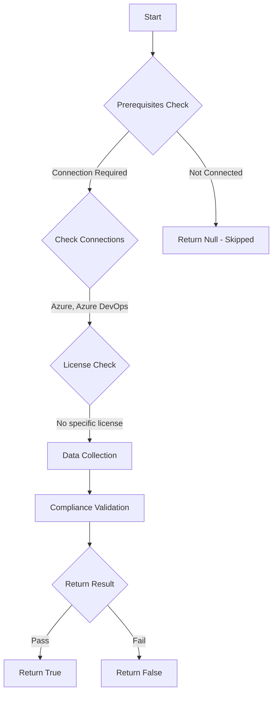

# Test-AzdoRestrictPersonalAccessTokenLifespan: Returns a boolean depending on the configuration.

## Overview

**Function Name:** `Test-AzdoRestrictPersonalAccessTokenLifespan`
**Category:** Maester/AzureDevOps

## Description

Checks if Personal Access Token lifespan restrictions are configured.

    https://learn.microsoft.com/en-us/azure/devops/organizations/accounts/manage-pats-with-policies-for-administrators?view=azure-devops#restrict-personal-access-token-lifespan

## Workflow

## Phase Details

### Phase 1: Prerequisites Check

**Required Connections:**
- Azure
- Azure DevOps

### Phase 2: Data Collection

**Cmdlets/Functions Used:**
- `Get-ADOPSTenantPolicy`

### Phase 3: Compliance Validation

The function validates the collected data against compliance requirements.

### Phase 4: Return Result

| Return Value | Meaning |
| --- | --- |
| `$true` | Compliant |
| `$false` | Non-Compliant |
| `$null` | Skipped (missing prerequisites, license, or error) |

## Original Documentation

Restrict setting a maximum Personal Access Token (PAT) lifespan **should be** enabled.

#### Prerequisites

- Your organization must be linked to a Microsoft Entra tenant.
- You must be an Azure DevOps Administrator to configure tenant policies.

#### Rationale

Restricting PAT lifespan by enforcing a maximum expiration reduces the risk of long-lived credentials being reused after compromise, helps meet compliance requirements, and encourages regular credential rotation.

#### Remediation action

Enable the tenant policy to enforce a maximum PAT lifespan.
1. Sign in to your organization (https://dev.azure.com/{yourorganization}).
2. Select Organization settings (gear icon).
3. Select Microsoft Entra, find the "Enforce maximum personal access token lifespan" policy.
4. Move the toggle to On.
5. Enter the maximum number of days and select Save.

#### Allowlist and exceptions

- Each tenant policy has its own allowlist; add Microsoft Entra users or groups to exempt them from the restriction.
- Use groups for allowlists; adding named users can create identity residency concerns.

**Existing PATs:**

Existing PATs remain valid until their configured expiration date and are not retroactively shortened by this setting.

**Results:**

When enabled, newly created or renewed PATs will have a maximum lifespan (in days) and will automatically expire after that period.

#### Related links
* [Learn - Restrict personal access token lifespan](https://learn.microsoft.com/en-us/azure/devops/organizations/accounts/manage-pats-with-policies-for-administrators?view=azure-devops#restrict-personal-access-token-lifespan)

## Standalone Function

See the standalone compliance check function: [`Test-AzdoRestrictPersonalAccessTokenLifespanCompliance.ps1`](../../standalone-functions/Maester/AzureDevOps/Test-AzdoRestrictPersonalAccessTokenLifespanCompliance.ps1)
