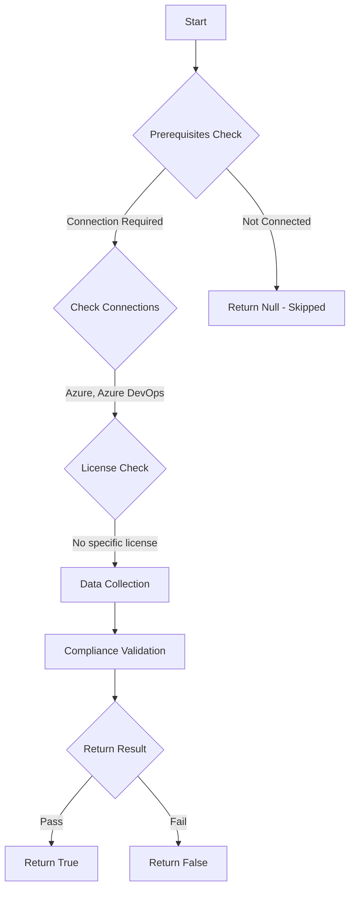

# Test-AzdoSSHAuthentication: Returns a boolean depending on the configuration.

## Overview

**Function Name:** `Test-AzdoSSHAuthentication`
**Category:** Maester/AzureDevOps

## Description

Checks the status of the possibility to use SSH keys to connect to Azure DevOps.

    https://aka.ms/vstspolicyssh
    https://learn.microsoft.com/en-us/azure/devops/repos/git/auth-overview?view=azure-devops&source=recommendations&tabs=Windows

## Workflow

## Phase Details

### Phase 1: Prerequisites Check

**Required Connections:**
- Azure
- Azure DevOps

### Phase 2: Data Collection

**Cmdlets/Functions Used:**
- `Get-ADOPSOrganizationPolicy`

### Phase 3: Compliance Validation

The function validates the collected data against compliance requirements.

### Phase 4: Return Result

| Return Value | Meaning |
| --- | --- |
| `$true` | Compliant |
| `$false` | Non-Compliant |
| `$null` | Skipped (missing prerequisites, license, or error) |

## Original Documentation

Connecting to Azure DevOps using SSH should be disabled.

Rationale: OAuth is the preferred and most secure authentication method.

#### Remediation action:
Disable the policy to stop these requests and notifications.
1. Sign in to your organization.
2. Choose Organization settings.
3. Select Policies under the Security section.
4. Locate the "SSH authentication" policy and toggle it to off.

**Results:**
Users can no longer use SSH to connect to Azure DevOps.

#### Related links

* [Learn - Use SSH key authentication](https://aka.ms/vstspolicyssh)
* [Learn - Authentication with Azure Repos](https://learn.microsoft.com/en-us/azure/devops/repos/git/auth-overview?view=azure-devops&source=recommendations&tabs=Windows)

## Standalone Function

See the standalone compliance check function: [`Test-AzdoSSHAuthenticationCompliance.ps1`](../../standalone-functions/Maester/AzureDevOps/Test-AzdoSSHAuthenticationCompliance.ps1)
