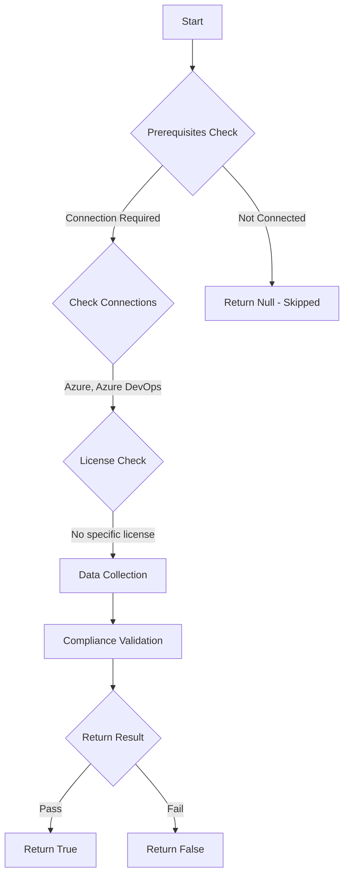

# Test-AzdoThirdPartyAccessViaOauth: Returns a boolean depending on the configuration.

## Overview

**Function Name:** `Test-AzdoThirdPartyAccessViaOauth`
**Category:** Maester/AzureDevOps

## Description

Checks the status of Third-party application access via OAuth.

    https://aka.ms/vstspolicyoauth
    https://learn.microsoft.com/en-us/azure/devops/integrate/get-started/authentication/azure-devops-oauth?view=azure-devops

## Workflow

## Phase Details

### Phase 1: Prerequisites Check

**Required Connections:**
- Azure
- Azure DevOps

### Phase 2: Data Collection

**Cmdlets/Functions Used:**
- `Get-ADOPSOrganizationPolicy`

### Phase 3: Compliance Validation

The function validates the collected data against compliance requirements.

### Phase 4: Return Result

| Return Value | Meaning |
| --- | --- |
| `$true` | Compliant |
| `$false` | Non-Compliant |
| `$null` | Skipped (missing prerequisites, license, or error) |

## Original Documentation

Third-party application access via OAuth should be disabled.

Rationale: Third-party application access should not be used for Azure DevOps.

#### Remediation action:
Disable the policy to stop these requests and notifications.
1. Sign in to your organization.
2. Choose Organization settings.
3. Select Policies, locate the Third-party application access via Oauth policy and toggle it to off.

**Results:**
With the policy disabled, third-party applications can no longer access your Azure DevOps organization via OAuth. Any application that previously relied on OAuth access will encounter authentication errors and lose access. This does not affect Microsoft Entra ID OAuth app access.

#### Related links

* [Learn - Change application connection & security policies for your organization](https://aka.ms/vstspolicyoauth)
* [Learn - Use Azure DevOps OAuth 2.0 to create a web app](https://learn.microsoft.com/en-us/azure/devops/integrate/get-started/authentication/azure-devops-oauth?view=azure-devops)

## Standalone Function

See the standalone compliance check function: [`Test-AzdoThirdPartyAccessViaOauthCompliance.ps1`](../../standalone-functions/Maester/AzureDevOps/Test-AzdoThirdPartyAccessViaOauthCompliance.ps1)
