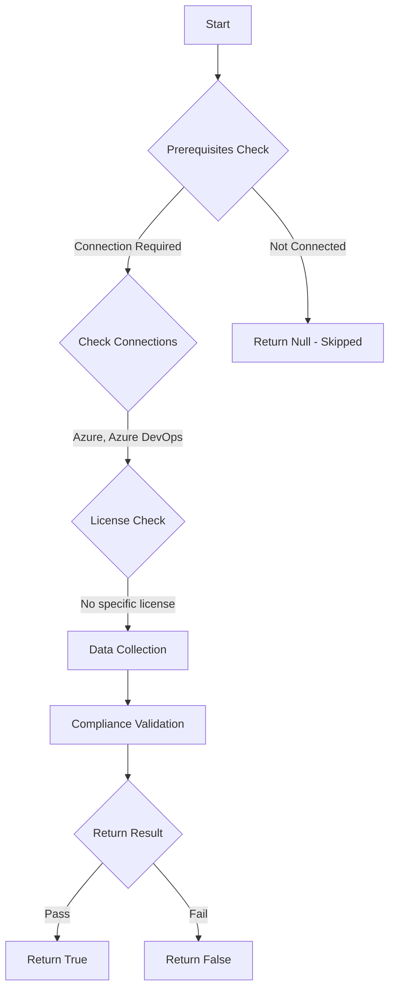

# Test-AzdoValidateSshKeyExpiration: Returns a boolean depending on the configuration.

## Overview

**Function Name:** `Test-AzdoValidateSshKeyExpiration`
**Category:** Maester/AzureDevOps

## Description

Checks if SSH key expiration validation is configured.

    https://learn.microsoft.com/en-us/azure/devops/organizations/accounts/change-application-access-policies?view=azure-devops#ssh-key-policies

## Workflow

## Phase Details

### Phase 1: Prerequisites Check

**Required Connections:**
- Azure
- Azure DevOps

### Phase 2: Data Collection

**Cmdlets/Functions Used:**
- `Get-ADOPSOrganizationPolicy`

### Phase 3: Compliance Validation

The function validates the collected data against compliance requirements.

### Phase 4: Return Result

| Return Value | Meaning |
| --- | --- |
| `$true` | Compliant |
| `$false` | Non-Compliant |
| `$null` | Skipped (missing prerequisites, license, or error) |

## Original Documentation

Validation of SSH key expiration date **should be** enabled.

Rationale: Expired SSH keys should not be valid for authentication towards Azure DevOps.

#### Remediation action:
Enable the policy to stop these requests and notifications.
1. Sign in to your organization.
2. Choose Organization settings.
3. Select Policies under Security.
4. Switch the Validate SSH key expiration button to ON.

**Results:**
When active, Azure DevOps enforces that keys with expired expiration dates immediately become invalid for authentication.

#### Related links

* [Learn - SSH key policies](https://learn.microsoft.com/en-us/azure/devops/organizations/accounts/change-application-access-policies?view=azure-devops#ssh-key-policies)
* [Learn - My SSH key has expired, what should I do?](https://learn.microsoft.com/en-us/azure/devops/repos/git/use-ssh-keys-to-authenticate?view=azure-devops#q-my-ssh-key-has-expired-what-should-i-do)

## Standalone Function

See the standalone compliance check function: [`Test-AzdoValidateSshKeyExpirationCompliance.ps1`](../../standalone-functions/Maester/AzureDevOps/Test-AzdoValidateSshKeyExpirationCompliance.ps1)
