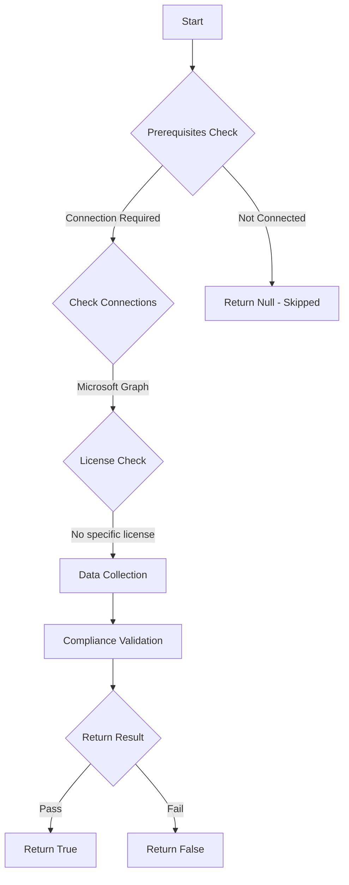

# Test-MtMdeCloudExtendedTimeout: Checks if cloud extended timeout is configured between 30-50 seconds

## Overview

**Function Name:** `Test-MtMdeCloudExtendedTimeout`
**Category:** Maester/Defender

## Description

Tests that all assigned Microsoft Defender Antivirus policies have the
        cloud extended timeout configured within the recommended range of 30-50 seconds.
        Insufficient cloud timeout may prevent thorough analysis of suspicious files.

## Workflow

## Phase Details

### Phase 1: Prerequisites Check

**Required Connections:**
- Microsoft Graph

### Phase 2: Data Collection

**Cmdlets/Functions Used:**
- `Get-MdeDeviceCount`
- `Get-MdePolicyConfiguration`

### Phase 3: Compliance Validation

The function validates the collected data against compliance requirements.

### Phase 4: Return Result

| Return Value | Meaning |
| --- | --- |
| `$true` | Compliant |
| `$false` | Non-Compliant |
| `$null` | Skipped (missing prerequisites, license, or error) |

## Original Documentation

Checks that the cloud extended timeout is configured between 30-50 seconds in all assigned Microsoft Defender Antivirus policies.

Insufficient cloud timeout may prevent thorough analysis of suspicious files, allowing potentially malicious content to bypass cloud-based detection.

#### Remediation action:

1. Open [Microsoft Endpoint Manager](https://endpoint.microsoft.com) > **Endpoint Security** > **Antivirus**
2. Edit the relevant Microsoft Defender Antivirus policy
3. Set **Cloud Extended Timeout** to 30-50 seconds

#### Related links

- [Configure Microsoft Defender Antivirus](https://learn.microsoft.com/microsoft-365/security/defender-endpoint/configure-microsoft-defender-antivirus-features)
- [Microsoft Endpoint Manager](https://endpoint.microsoft.com)

<!--- Results --->
%TestResult%

## Standalone Function

See the standalone compliance check function: [`Test-MtMdeCloudExtendedTimeoutCompliance.ps1`](../../standalone-functions/Maester/Defender/Test-MtMdeCloudExtendedTimeoutCompliance.ps1)
