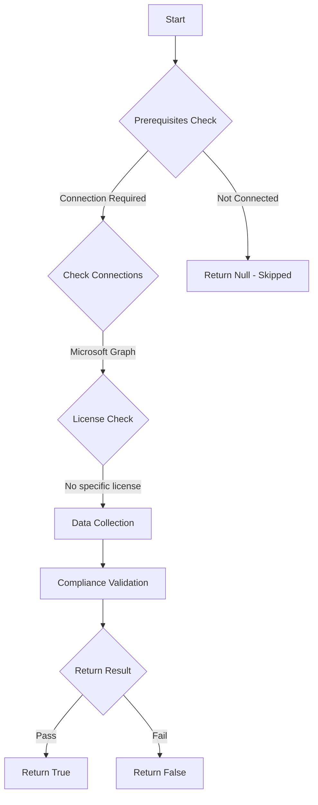

# Test-MtMdeDisableLocalAdminMerge: Checks if local admin merge is disabled to block local exclusions

## Overview

**Function Name:** `Test-MtMdeDisableLocalAdminMerge`
**Category:** Maester/Defender

## Description

Tests that all assigned Microsoft Defender Antivirus policies have the
        disable local admin merge setting enabled. Local admin policy override
        allows privilege escalation to bypass security controls on managed devices.

## Workflow

## Phase Details

### Phase 1: Prerequisites Check

**Required Connections:**
- Microsoft Graph

### Phase 2: Data Collection

**Cmdlets/Functions Used:**
- `Get-MdeDeviceCount`
- `Get-MdePolicyConfiguration`

### Phase 3: Compliance Validation

The function validates the collected data against compliance requirements.

### Phase 4: Return Result

| Return Value | Meaning |
| --- | --- |
| `$true` | Compliant |
| `$false` | Non-Compliant |
| `$null` | Skipped (missing prerequisites, license, or error) |

## Original Documentation

Checks that local admin merge is disabled to block local exclusions in all assigned Microsoft Defender Antivirus policies.

Local admin policy override allows privilege escalation to bypass security controls, enabling local administrators to add exclusions that weaken endpoint protection.

#### Remediation action:

1. Open [Microsoft Endpoint Manager](https://endpoint.microsoft.com) > **Endpoint Security** > **Antivirus**
2. Edit the relevant Microsoft Defender Antivirus policy
3. Enable **Disable Local Admin Merge** to prevent local overrides

#### Related links

- [Configure Microsoft Defender Antivirus](https://learn.microsoft.com/microsoft-365/security/defender-endpoint/configure-microsoft-defender-antivirus-features)
- [Microsoft Endpoint Manager](https://endpoint.microsoft.com)

<!--- Results --->
%TestResult%

## Standalone Function

See the standalone compliance check function: [`Test-MtMdeDisableLocalAdminMergeCompliance.ps1`](../../standalone-functions/Maester/Defender/Test-MtMdeDisableLocalAdminMergeCompliance.ps1)
