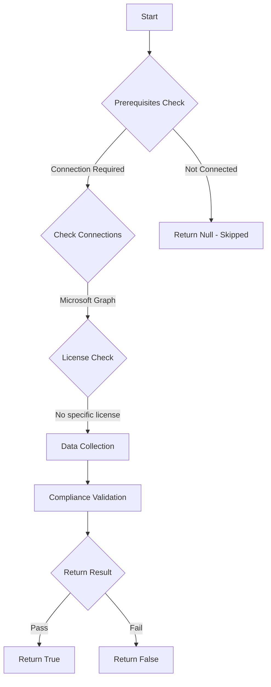

# Test-MtMdeRetainCleanedMalware: Checks if cleaned malware is retained for at least 30 days for forensic analysis

## Overview

**Function Name:** `Test-MtMdeRetainCleanedMalware`
**Category:** Maester/Defender

## Description

Verify that cleaned malware is retained for at least 30 days to support forensic
        analysis and threat investigation. Short retention may impact forensic analysis
        and threat investigation.

## Workflow

## Phase Details

### Phase 1: Prerequisites Check

**Required Connections:**
- Microsoft Graph

### Phase 2: Data Collection

**Cmdlets/Functions Used:**
- `Get-MdeDeviceCount`
- `Get-MdePolicyConfiguration`

### Phase 3: Compliance Validation

The function validates the collected data against compliance requirements.

### Phase 4: Return Result

| Return Value | Meaning |
| --- | --- |
| `$true` | Compliant |
| `$false` | Non-Compliant |
| `$null` | Skipped (missing prerequisites, license, or error) |

## Original Documentation

Verify that cleaned malware is retained for at least 30 days to support forensic analysis and threat investigation.

Short retention may impact forensic analysis and threat investigation.

#### Remediation action:

1. Open [Microsoft Endpoint Manager](https://endpoint.microsoft.com) > **Endpoint Security** > **Antivirus**
2. Edit the relevant Microsoft Defender Antivirus policy
3. Set **Days to Retain Cleaned Malware** to at least 30 days (recommended: 90 days)

#### Related links

- [Configure Microsoft Defender Antivirus](https://learn.microsoft.com/microsoft-365/security/defender-endpoint/configure-microsoft-defender-antivirus-features)
- [Microsoft Endpoint Manager](https://endpoint.microsoft.com)

<!--- Results --->
%TestResult%

## Standalone Function

See the standalone compliance check function: [`Test-MtMdeRetainCleanedMalwareCompliance.ps1`](../../standalone-functions/Maester/Defender/Test-MtMdeRetainCleanedMalwareCompliance.ps1)
