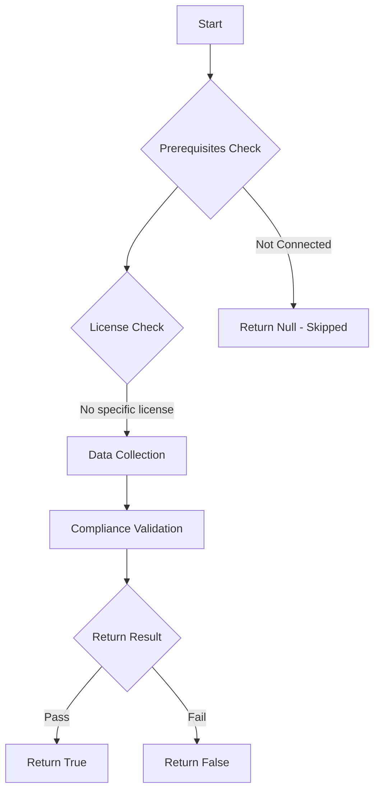

# Get-ObjectDifference: 

## Overview

**Function Name:** `Get-ObjectDifference`
**Category:** Maester/Entra

## Description

## Workflow

## Phase Details

### Phase 1: Prerequisites Check

No specific prerequisites required.

### Phase 2: Data Collection

**Graph API Calls:**
- `identity/conditionalAccess/namedLocations`
- `directoryRoles`
- `users`
- `servicePrincipals`
- `groups`

**Cmdlets/Functions Used:**
- `Get-ObjectDifference`
- `Get-RelatedPolicy`
- `Get-MtConditionalAccessPolicy`
- `Invoke-MtGraphRequest`

### Phase 3: Compliance Validation

The function validates the collected data against compliance requirements.

### Phase 4: Return Result

| Return Value | Meaning |
| --- | --- |
| `$true` | Compliant |
| `$false` | Non-Compliant |
| `$null` | Skipped (missing prerequisites, license, or error) |

## Standalone Function

See the standalone compliance check function: [`Get-ObjectDifferenceCompliance.ps1`](../../standalone-functions/Maester/Entra/Get-ObjectDifferenceCompliance.ps1)
