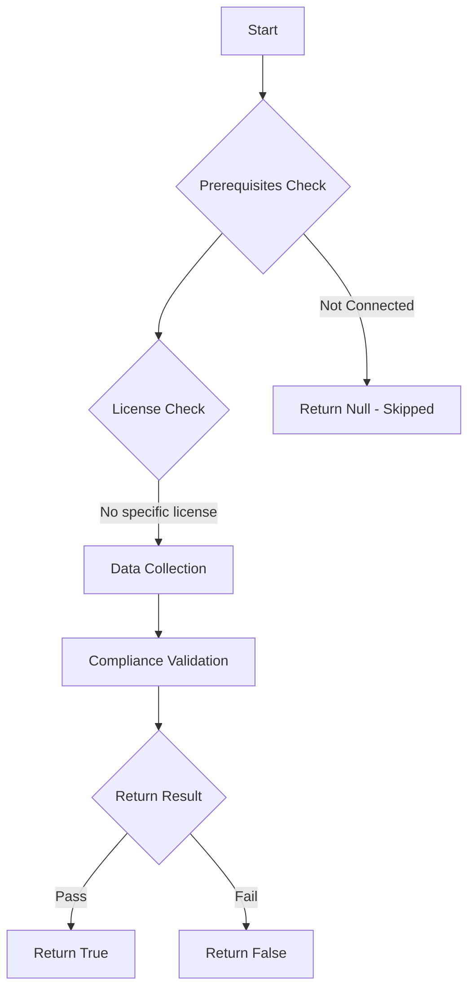

# Test-MtAppManagementPolicyEnabled: 

## Overview

**Function Name:** `Test-MtAppManagementPolicyEnabled`
**Category:** Maester/Entra

## Description


## Workflow



## Phase Details

### Phase 1: Prerequisites Check

No specific prerequisites required.

### Phase 2: Data Collection

**Graph API Calls:**
- `policies/defaultAppManagementPolicy`

**Cmdlets/Functions Used:**
- `Invoke-MtGraphRequest`

### Phase 3: Compliance Validation

The function validates the collected data against compliance requirements.

### Phase 4: Return Result

| Return Value | Meaning |
| --- | --- |
| `$true` | Compliant |
| `$false` | Non-Compliant |
| `$null` | Skipped (missing prerequisites, license, or error) |

## Original Documentation

By default Microsoft Entra ID allows service principals and applications to be configured with weak credentials.

This can include

- client secrets instead of certificates
- secrets and certificates with long expiry (e.g. 10 year)

## How to fix

Using shorter expiry periods and certificates instead of secrets can help reduce the risk of credentials being compromised and used by an attacker.

The sample policy below can be used to enforce credential configurations on apps and service principals.

```powershell
Import-Module Microsoft.Graph.Identity.SignIns

$params = @{
isEnabled = $true
applicationRestrictions = @{
    passwordCredentials = @(
    @{
        restrictionType = "passwordAddition"
        maxLifetime = $null
        restrictForAppsCreatedAfterDateTime = [System.DateTime]::Parse("2021-01-01T10:37:00Z")
    }
    @{
        restrictionType = "passwordLifetime"
        maxLifetime = "P365D"
        restrictForAppsCreatedAfterDateTime = [System.DateTime]::Parse("2017-01-01T10:37:00Z")
    }
    @{
        restrictionType = "symmetricKeyAddition"
        maxLifetime = $null
        restrictForAppsCreatedAfterDateTime = [System.DateTime]::Parse("2021-01-01T10:37:00Z")
    }
    @{
        restrictionType = "customPasswordAddition"
        maxLifetime = $null
        restrictForAppsCreatedAfterDateTime = [System.DateTime]::Parse("2015-01-01T10:37:00Z")
    }
    @{
        restrictionType = "symmetricKeyLifetime"
        maxLifetime = "P365D"
        restrictForAppsCreatedAfterDateTime = [System.DateTime]::Parse("2015-01-01T10:37:00Z")
    }
    )
    keyCredentials = @(
    @{
        restrictionType = "asymmetricKeyLifetime"
        maxLifetime = "P365D"
        restrictForAppsCreatedAfterDateTime = [System.DateTime]::Parse("2015-01-01T10:37:00Z")
    }
    )
}
}

Update-MgPolicyDefaultAppManagementPolicy -BodyParameter $params
```

## Learn more

- [Tenant App Management Policy - Microsoft Graph Reference](https://learn.microsoft.com/graph/api/resources/tenantappmanagementpolicy?view=graph-rest-1.0)
- [What are Workload ID Premium features, and which are free?](https://learn.microsoft.com/en-us/entra/workload-id/workload-identities-faqs#what-are-workload-id-premium-features-and-which-are-free)
- [Microsoft Entra application management policies API overview](https://learn.microsoft.com/en-us/graph/api/resources/applicationauthenticationmethodpolicy?view=graph-rest-1.0#requirements)

## Standalone Function

See the standalone compliance check function: [`Test-MtAppManagementPolicyEnabledCompliance.ps1`](../../standalone-functions/Maester/Entra/Test-MtAppManagementPolicyEnabledCompliance.ps1)
