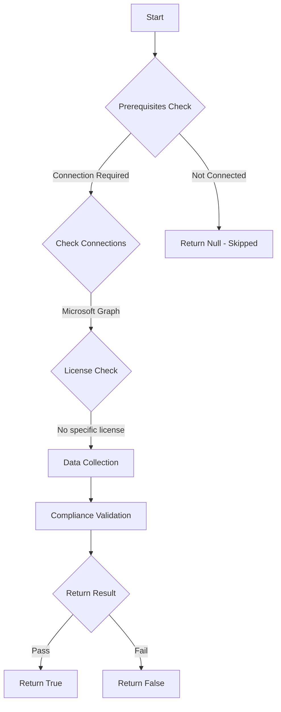

# App: Tests if app registration owners have Multi-Factor Authentication (MFA) enabled.

## Overview

**Function Name:** `Test-MtAppRegistrationOwnersWithoutMFA`
**Category:** Maester/Entra
**Test Tag:** `App`

## Description

This function checks all Entra ID app registrations and verifies that their owners have MFA registered.

## Workflow

## Phase Details

### Phase 1: Prerequisites Check

**Required Connections:**
- Microsoft Graph

### Phase 2: Data Collection

**Graph API Calls:**
- `applications?$expand=owners`
- `reports/authenticationMethods/userRegistrationDetails?$select=id,userPrincipalName,userDisplayName,isMfaRegistered`

**Cmdlets/Functions Used:**
- `Invoke-MtGraphRequest`

### Phase 3: Compliance Validation

The function validates the collected data against compliance requirements.

### Phase 4: Return Result

| Return Value | Meaning |
| --- | --- |
| `$true` | Compliant |
| `$false` | Non-Compliant |
| `$null` | Skipped (missing prerequisites, license, or error) |

## Original Documentation

This test checks if all owners of app registrations have Multi-Factor Authentication (MFA) registered. App registration owners without MFA pose a significant security risk as credential stuffing attacks can lead to privileged access and potential privilege escalation or data loss.

## Why This Matters

App registration owners have powerful permissions that attackers actively target:

- **Credential Stuffing Risk**: Without MFA, compromised passwords from data breaches provide immediate access
- **Privileged App Access**: Owners can modify app permissions, certificates, and redirect URIs
- **Privilege Escalation**: Compromised owners can grant themselves or malicious apps excessive permissions
- **Lateral Movement**: Access to one app registration can be leveraged to compromise other resources

## Attack Scenario

1. **Initial Compromise**: Attacker uses leaked credentials to access owner account (no MFA protection)
2. **App Manipulation**: Attacker modifies app registration to add malicious redirect URIs, certificates or secrets
3. **Broader Access**: Compromised app is used to access sensitive data across the organization or to escalate privileges

#### Remediation action
Register MFA for all app registration owners listed. Use conditional access policies to enforce MFA for all application owners.

<!--- Results --->
%TestResult%

## Standalone Function

See the standalone compliance check function: [`Test-MtAppRegistrationOwnersWithoutMFACompliance.ps1`](../../standalone-functions/Maester/Entra/Test-MtAppRegistrationOwnersWithoutMFACompliance.ps1)
