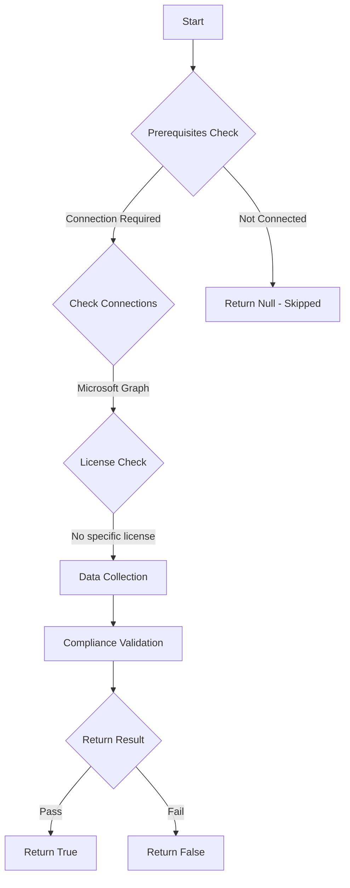

# Test-MtAppRegistrationsWithSecrets: Check if any service principals are still using secrets instead of certificates or managed identities.

## Overview

**Function Name:** `Test-MtAppRegistrationsWithSecrets`
**Category:** Maester/Entra

## Description

It is advised to use certificates or managed identities instead of secrets for service principals. This test checks if any service principals are still using secrets.

## Workflow

## Phase Details

### Phase 1: Prerequisites Check

**Required Connections:**
- Microsoft Graph

### Phase 2: Data Collection

**Graph API Calls:**
- `applications?$select=id,displayName,appId,passwordCredentials`

**Cmdlets/Functions Used:**
- `Invoke-MtGraphRequest`

### Phase 3: Compliance Validation

The function validates the collected data against compliance requirements.

### Phase 4: Return Result

| Return Value | Meaning |
| --- | --- |
| `$true` | Compliant |
| `$false` | Non-Compliant |
| `$null` | Skipped (missing prerequisites, license, or error) |

## Original Documentation

This test checks if you have any app registrations that have secrets configured. Using secrets is discouraged! There are better ways available to authenticate your applications.

#### Remediation action

Open all app registrations below and remove the secrets.

<!--- Results --->

%TestResult%

## Standalone Function

See the standalone compliance check function: [`Test-MtAppRegistrationsWithSecretsCompliance.ps1`](../../standalone-functions/Maester/Entra/Test-MtAppRegistrationsWithSecretsCompliance.ps1)
