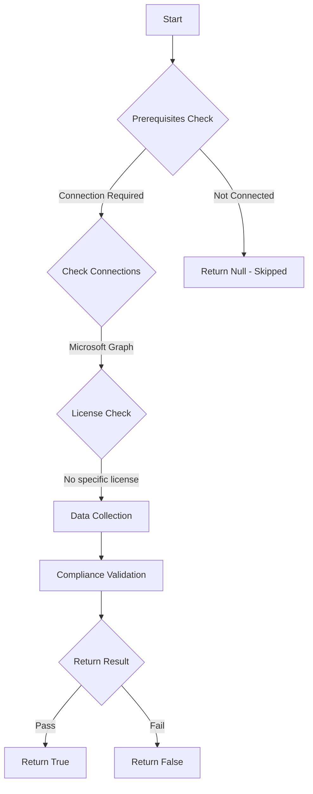

# Test-MtAuthenticationPolicyReferencedObjectsExist: 

## Overview

**Function Name:** `Test-MtAuthenticationPolicyReferencedObjectsExist`
**Category:** Maester/Entra

## Description

## Workflow

## Phase Details

### Phase 1: Prerequisites Check

**Required Connections:**
- Microsoft Graph

### Phase 2: Data Collection

**Graph API Calls:**
- `groups/$groupId`

**Cmdlets/Functions Used:**
- `Get-MtAuthenticationMethodPolicyConfig`
- `Invoke-MtGraphRequest`

### Phase 3: Compliance Validation

The function validates the collected data against compliance requirements.

### Phase 4: Return Result

| Return Value | Meaning |
| --- | --- |
| `$true` | Compliant |
| `$false` | Non-Compliant |
| `$null` | Skipped (missing prerequisites, license, or error) |

## Original Documentation

# Authentication method policies should not reference non-existent groups

This test checks if all groups referenced in authentication method policies still exist in the tenant.

Authentication method policies can reference groups in their includeTargets configuration. If a group is deleted but still referenced in an authentication method policy, it may cause the policy to not apply as expected or result in unexpected behavior.

The test examines includeTargets for all authentication method configurations and validates that any group references are valid and the groups still exist in the tenant.

## How to fix

If this test fails, you need to:

1. **Review the failed authentication method policies** - Check which policies are referencing non-existent groups
2. **Remove invalid group references** - Edit the authentication method policy to remove references to deleted groups
3. **Replace with valid groups** - If needed, replace the deleted group reference with a valid existing group

To fix the issue:

1. Go to the [Microsoft Entra admin center](https://entra.microsoft.com)
2. Navigate to **Protection** > **Authentication methods**
3. Select the impacted authentication method
4. In the **Include** section, remove the invalid group references
5. If needed, add valid replacement groups
6. Save the changes

## Learn more

- [Authentication methods in Microsoft Entra ID](https://learn.microsoft.com/entra/identity/authentication/concept-authentication-methods)
- [Manage authentication methods](https://learn.microsoft.com/entra/identity/authentication/concept-authentication-methods-manage)
- [Authentication method policies](https://learn.microsoft.com/entra/identity/authentication/concept-authentication-methods-activities)

## Related links

- [Entra admin center - Authentication methods](https://entra.microsoft.com/#view/Microsoft_AAD_IAM/AuthenticationMethodsMenuBlade/~/AdminAuthMethods/fromNav/Identity)
- [Entra admin center - Groups](https://entra.microsoft.com/#view/Microsoft_AAD_IAM/GroupsManagementMenuBlade/~/AllGroups/menuId/AllGroups)

<!--- Results --->
%TestResult%

## Standalone Function

See the standalone compliance check function: [`Test-MtAuthenticationPolicyReferencedObjectsExistCompliance.ps1`](../../standalone-functions/Maester/Entra/Test-MtAuthenticationPolicyReferencedObjectsExistCompliance.ps1)
