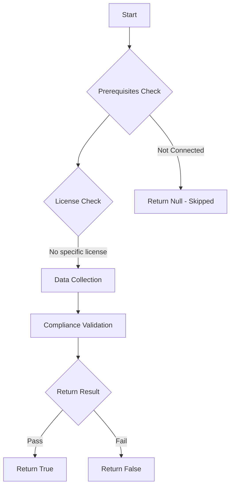

# Test-MtCaApprovedClientApp: 

## Overview

**Function Name:** `Test-MtCaApprovedClientApp`
**Category:** Maester/Entra

## Description

## Workflow

## Phase Details

### Phase 1: Prerequisites Check

No specific prerequisites required.

### Phase 2: Data Collection

**Cmdlets/Functions Used:**
- `Get-MtConditionalAccessPolicy`

### Phase 3: Compliance Validation

The function validates the collected data against compliance requirements.

### Phase 4: Return Result

| Return Value | Meaning |
| --- | --- |
| `$true` | Compliant |
| `$false` | Non-Compliant |
| `$null` | Skipped (missing prerequisites, license, or error) |

## Original Documentation

Checks if the tenant has no conditional access policy that requires an approved client app.

The approved client app grant is retiring in early March 2026. Organizations must transition all current Conditional Access policies that use only the Require Approved Client App grant control to Require Approved Client App or Application Protection Policy by March 2026. Additionally, for any new Conditional Access policy, only apply the Require application protection policy grant.

After March 2026, Microsoft will stop enforcing require approved client app control, and it will be as if this grant isn't selected. Use the following steps before March 2026 to protect your organization’s data.

## Learn more
- [Migrate approved client app to application protection policy in Conditional Access](https://learn.microsoft.com/en-us/entra/identity/conditional-access/migrate-approved-client-app)

<!--- Results --->
%TestResult%

## Standalone Function

See the standalone compliance check function: [`Test-MtCaApprovedClientAppCompliance.ps1`](../../standalone-functions/Maester/Entra/Test-MtCaApprovedClientAppCompliance.ps1)
