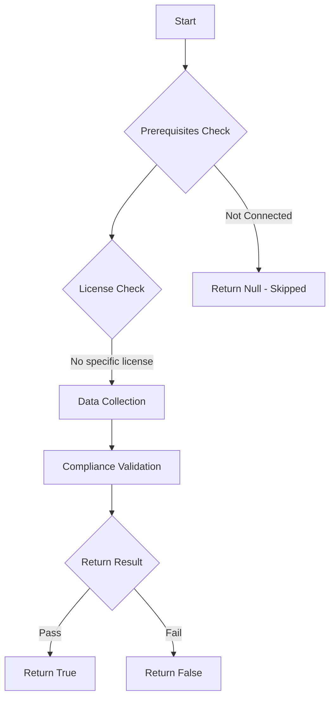

# Test-MtCaDeviceCodeFlow: 

## Overview

**Function Name:** `Test-MtCaDeviceCodeFlow`
**Category:** Maester/Entra

## Description

## Workflow

## Phase Details

### Phase 1: Prerequisites Check

No specific prerequisites required.

### Phase 2: Data Collection

**Cmdlets/Functions Used:**
- `Get-MtConditionalAccessPolicy`

### Phase 3: Compliance Validation

The function validates the collected data against compliance requirements.

### Phase 4: Return Result

| Return Value | Meaning |
| --- | --- |
| `$true` | Compliant |
| `$false` | Non-Compliant |
| `$null` | Skipped (missing prerequisites, license, or error) |

## Original Documentation

Checks if at least one policy is targeting the Device Code condition.

Organizations should block or limit device code flow because it can be exploited in phishing attacks, such as those conducted by the Storm-2372 group.
Attackers leverage this authentication method to trick users into entering device codes on malicious websites, granting unauthorized access to accounts.
Blocking or limiting this flow helps prevent exploitation by minimizing attack vectors, improving overall security posture, and safeguarding against compromised credentials through phishing techniques.

## How to fix

Configure a Conditional Access policy to block the Device Code authentication flow and limit access to only trusted users and devices or to specific named locations.

## Learn more
  - [Block authentication flows with Conditional Access policy](https://learn.microsoft.com/entra/identity/conditional-access/policy-block-authentication-flows)
  - [Microsoft Threat Intelligence | Storm-2372 conducts device code phishing campaign](https://www.microsoft.com/security/blog/2025/02/13/storm-2372-conducts-device-code-phishing-campaign/)
  - [Jeffrey Appel | How to protect against Device Code Flow abuse (Storm-2372 attacks) and block the authentication flow](https://jeffreyappel.nl/how-to-protect-against-device-code-flow-abuse-storm-2372-attacks-and-block-the-authentication-flow/)

<!--- Results --->
%TestResult%

## Standalone Function

See the standalone compliance check function: [`Test-MtCaDeviceCodeFlowCompliance.ps1`](../../standalone-functions/Maester/Entra/Test-MtCaDeviceCodeFlowCompliance.ps1)
