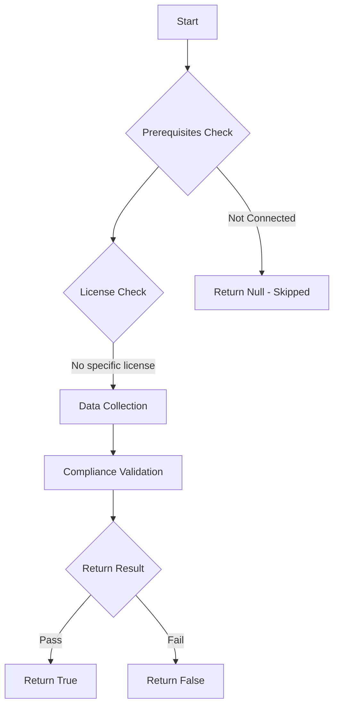

# Test-MtCaEmergencyAccessExists: 

## Overview

**Function Name:** `Test-MtCaEmergencyAccessExists`
**Category:** Maester/Entra

## Description

## Workflow

## Phase Details

### Phase 1: Prerequisites Check

No specific prerequisites required.

### Phase 2: Data Collection

**Graph API Calls:**
- `users/$CheckId`
- `groups/$CheckId`

**Cmdlets/Functions Used:**
- `Get-MtMaesterConfigGlobalSetting`
- `Get-MtConditionalAccessPolicy`
- `Invoke-MtGraphRequest`

### Phase 3: Compliance Validation

**Properties Checked:**

| Property | Expected Value |
| --- | --- |
| `type` | `user` |
| `type` | `group` |

### Phase 4: Return Result

| Return Value | Meaning |
| --- | --- |
| `$true` | Compliant |
| `$false` | Non-Compliant |
| `$null` | Skipped (missing prerequisites, license, or error) |

## Original Documentation

It is recommended to have at least one emergency/break glass account or account group excluded from all conditional access policies.
This allows for emergency access to the tenant in case of a misconfiguration or other issues.

See [Manage emergency access accounts in Microsoft Entra ID - Microsoft Learn](https://learn.microsoft.com/entra/identity/role-based-access-control/security-emergency-access)

<!--- Results --->
%TestResult%

## Standalone Function

See the standalone compliance check function: [`Test-MtCaEmergencyAccessExistsCompliance.ps1`](../../standalone-functions/Maester/Entra/Test-MtCaEmergencyAccessExistsCompliance.ps1)
