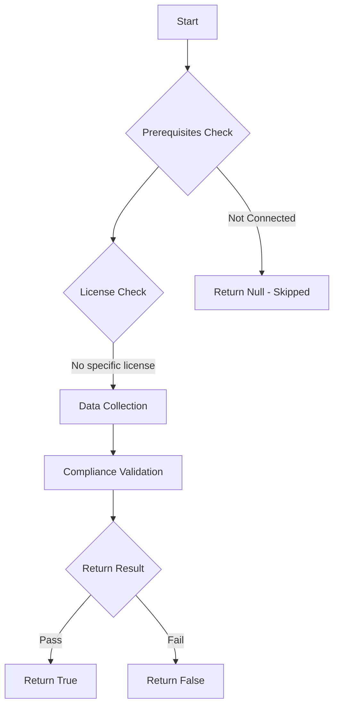

# Test-MtCaGroupsRestricted: 

## Overview

**Function Name:** `Test-MtCaGroupsRestricted`
**Category:** Maester/Entra

## Description

## Workflow

## Phase Details

### Phase 1: Prerequisites Check

No specific prerequisites required.

### Phase 2: Data Collection

**Graph API Calls:**
- `groups/$($Group)`

**Cmdlets/Functions Used:**
- `Get-MtConditionalAccessPolicy`
- `Invoke-MtGraphRequest`
- `Get-GraphObjectMarkdown`

### Phase 3: Compliance Validation

The function validates the collected data against compliance requirements.

### Phase 4: Return Result

| Return Value | Meaning |
| --- | --- |
| `$true` | Compliant |
| `$false` | Non-Compliant |
| `$null` | Skipped (missing prerequisites, license, or error) |

## Original Documentation

Security Groups will be used to exclude and include users from Conditional Access Policies. Modify group membership outside of Conditional Access Administrator or other privileged roles can lead to bypassing Conditional Access Policies.

To prevent this, you can protect these groups by using Restricted Management Administrative Units or Role Assignable Groups. Role Assignable Group should be used in combination of assignments to Entra ID roles. Restricted Management Administrative Units should be used to protect groups by restricting management to specific users or groups. This test checks if all groups used in Conditional Access Policies are protected.

See [Restricted management administrative units in Microsoft Entra ID - Microsoft Entra ID | Microsoft Learn](https://learn.microsoft.com/en-us/entra/identity/role-based-access-control/admin-units-restricted-management)

## Standalone Function

See the standalone compliance check function: [`Test-MtCaGroupsRestrictedCompliance.ps1`](../../standalone-functions/Maester/Entra/Test-MtCaGroupsRestrictedCompliance.ps1)
