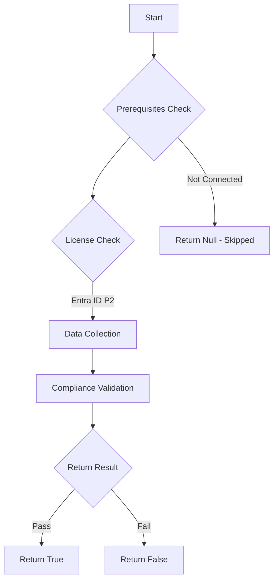

# Test-MtCaLicenseUtilization: Test Conditional Access License Utilization and return stats on usage for the specific license.

## Overview

**Function Name:** `Test-MtCaLicenseUtilization`
**Category:** Maester/Entra

## Description

Utilization is validated using the insights provided by Microsoft Graph.

    Learn more:
    https://techcommunity.microsoft.com/t5/microsoft-entra-blog/introducing-microsoft-entra-license-utilization-insights/ba-p/3796393

## Workflow

## Phase Details

### Phase 1: Prerequisites Check

**Required Licenses:**
- Entra ID P2

### Phase 2: Data Collection

**Graph API Calls:**
- `reports/azureADPremiumLicenseInsight`

**Cmdlets/Functions Used:**
- `Get-MtTotalEntraIdUserCount`
- `Invoke-MtGraphRequest`

### Phase 3: Compliance Validation

The function validates the collected data against compliance requirements.

### Phase 4: Return Result

| Return Value | Meaning |
| --- | --- |
| `$true` | Compliant |
| `$false` | Non-Compliant |
| `$null` | Skipped (missing prerequisites, license, or error) |

## Standalone Function

See the standalone compliance check function: [`Test-MtCaLicenseUtilizationCompliance.ps1`](../../standalone-functions/Maester/Entra/Test-MtCaLicenseUtilizationCompliance.ps1)
