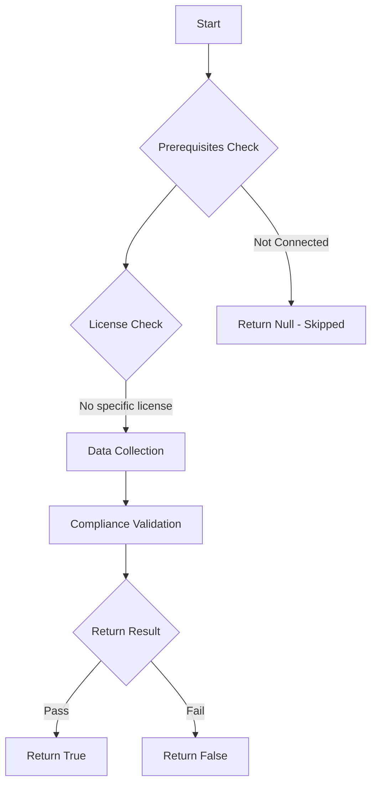

# Test-MtCaMfaForAdmin: 

## Overview

**Function Name:** `Test-MtCaMfaForAdmin`
**Category:** Maester/Entra

## Description

## Workflow

## Phase Details

### Phase 1: Prerequisites Check

No specific prerequisites required.

### Phase 2: Data Collection

**Cmdlets/Functions Used:**
- `Get-MtConditionalAccessPolicy`

### Phase 3: Compliance Validation

The function validates the collected data against compliance requirements.

### Phase 4: Return Result

| Return Value | Meaning |
| --- | --- |
| `$true` | Compliant |
| `$false` | Non-Compliant |
| `$null` | Skipped (missing prerequisites, license, or error) |

## Original Documentation

This test checks if the tenant has at least one conditional access policy requiring MFA for admins.
The following roles are considered as admin roles:

- Global Administrator
- Application Administrator
- Authentication Administrator
- Billing Administrator
- Cloud Application Administrator
- Conditional Access Administrator
- Exchange Administrator
- Helpdesk Administrator
- Password Administrator
- Privileged Authentication Administrator
- Privileged Role Administrator
- Security Administrator
- SharePoint Administrator
- User Administrator

See [Require MFA for administrators - Microsoft Learn](https://learn.microsoft.com/entra/identity/conditional-access/howto-conditional-access-policy-admin-mfa)"

<!--- Results --->

%TestResult%

## Standalone Function

See the standalone compliance check function: [`Test-MtCaMfaForAdminCompliance.ps1`](../../standalone-functions/Maester/Entra/Test-MtCaMfaForAdminCompliance.ps1)
