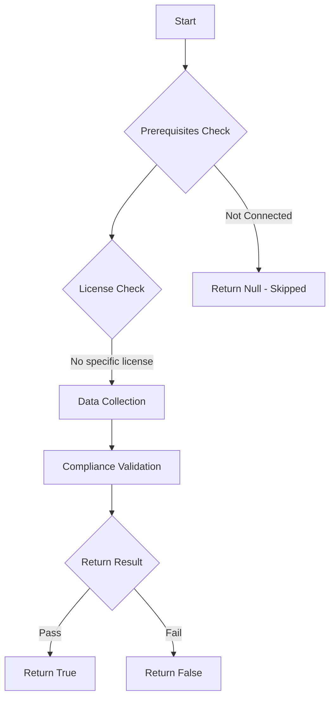

# Test-MtCaMfaForGuest: 

## Overview

**Function Name:** `Test-MtCaMfaForGuest`
**Category:** Maester/Entra

## Description

## Workflow

## Phase Details

### Phase 1: Prerequisites Check

No specific prerequisites required.

### Phase 2: Data Collection

**Cmdlets/Functions Used:**
- `Get-MtConditionalAccessPolicy`

### Phase 3: Compliance Validation

The function validates the collected data against compliance requirements.

### Phase 4: Return Result

| Return Value | Meaning |
| --- | --- |
| `$true` | Compliant |
| `$false` | Non-Compliant |
| `$null` | Skipped (missing prerequisites, license, or error) |

## Original Documentation

This check verifies if there is at least one conditional access policy that requires multifactor authentication for all guest accounts.

See [Require multifactor authentication for guest access - Microsoft Learn](https://learn.microsoft.com/entra/identity/conditional-access/howto-policy-guest-mfa)
<!--- Results --->
%TestResult%

## Standalone Function

See the standalone compliance check function: [`Test-MtCaMfaForGuestCompliance.ps1`](../../standalone-functions/Maester/Entra/Test-MtCaMfaForGuestCompliance.ps1)
