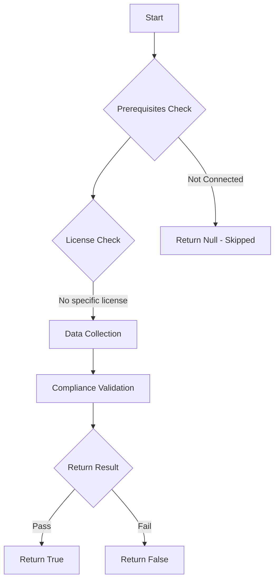

# Test-MtCaReferencedGroupsExist: 

## Overview

**Function Name:** `Test-MtCaReferencedGroupsExist`
**Category:** Maester/Entra

## Description

## Workflow

## Phase Details

### Phase 1: Prerequisites Check

No specific prerequisites required.

### Phase 2: Data Collection

**Graph API Calls:**
- `groups/$($Group)`

**Cmdlets/Functions Used:**
- `Get-MtConditionalAccessPolicy`
- `Invoke-MtGraphRequest`
- `Get-GraphObjectMarkdown`

### Phase 3: Compliance Validation

The function validates the collected data against compliance requirements.

### Phase 4: Return Result

| Return Value | Meaning |
| --- | --- |
| `$true` | Compliant |
| `$false` | Non-Compliant |
| `$null` | Skipped (missing prerequisites, license, or error) |

## Original Documentation

This test checks if there are any Conditional Access policies that target deleted security groups.

This usually happens when a group is deleted but is still referenced in a Conditional Access policy.

Deleted groups in your policy can lead to unexpected gaps. This may result in Conditional Access policies not being applied to the users you intended or the policy not being applied at all.

To fix this issue:

* Open the impacted Conditional access policy.
* If the group is no longer needed, click Save to remove the referenced group from the policy.
* If the group is still needed, update the policy to target a valid group.

<!--- Results --->

%TestResult%

## Standalone Function

See the standalone compliance check function: [`Test-MtCaReferencedGroupsExistCompliance.ps1`](../../standalone-functions/Maester/Entra/Test-MtCaReferencedGroupsExistCompliance.ps1)
