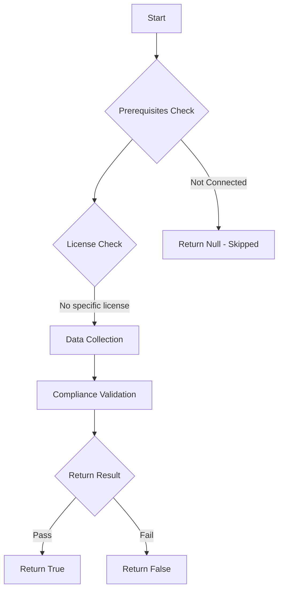

# Test-MtCaReferencedObjectsExist: 

## Overview

**Function Name:** `Test-MtCaReferencedObjectsExist`
**Category:** Maester/Entra

## Description

## Workflow

## Phase Details

### Phase 1: Prerequisites Check

No specific prerequisites required.

### Phase 2: Data Collection

**Graph API Calls:**
- `users/$user`
- `roleManagement/directory/roleDefinitions/$role`
- `groups/$group`

**Cmdlets/Functions Used:**
- `Get-MtConditionalAccessPolicy`
- `Invoke-MtGraphRequest`
- `Get-GraphObjectMarkdown`

### Phase 3: Compliance Validation

The function validates the collected data against compliance requirements.

### Phase 4: Return Result

| Return Value | Meaning |
| --- | --- |
| `$true` | Compliant |
| `$false` | Non-Compliant |
| `$null` | Skipped (missing prerequisites, license, or error) |

## Original Documentation

# Conditional Access policies should not reference non-existent users, groups, or roles

This test checks if there are any Conditional Access policies that reference non-existent users, groups, or roles.

This usually happens when a user, group, or role is deleted but is still referenced in a Conditional Access policy.

Non-existent objects in your policy can lead to unexpected gaps or behavior. This may result in Conditional Access policies not being applied to the intended users or the policy not functioning as expected.

## How to fix

To fix this issue:

* Open the impacted Conditional Access policy.
* Remove the non-existent user, group, or role from the policy.
* If the object is still needed, recreate it or replace it with a valid alternative.
* Click Save to apply the changes.

## Learn more

* [Conditional Access: Users and groups](https://learn.microsoft.com/entra/identity/conditional-access/concept-conditional-access-users-groups)
* [Manage Conditional Access policies](https://learn.microsoft.com/entra/identity/conditional-access/manage-conditional-access-policies)

<!--- Results --->
%TestResult%

## Standalone Function

See the standalone compliance check function: [`Test-MtCaReferencedObjectsExistCompliance.ps1`](../../standalone-functions/Maester/Entra/Test-MtCaReferencedObjectsExistCompliance.ps1)
