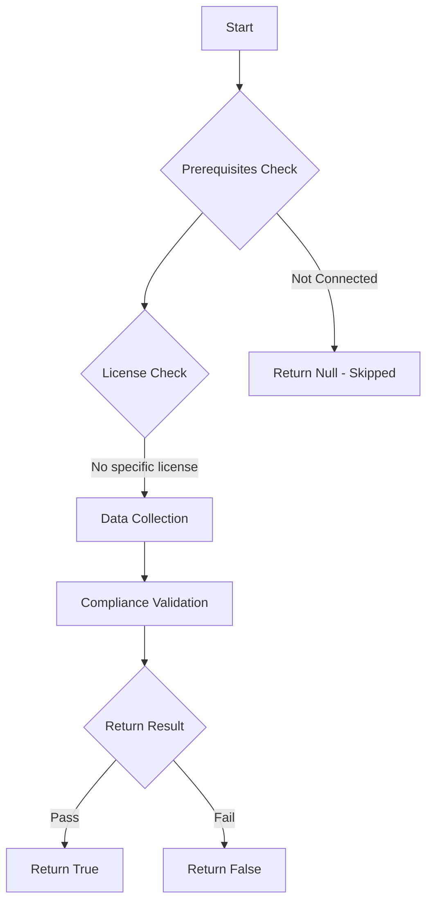

# Test-MtCaWIFBlockLegacyAuthentication: Checks if the user is blocked from using legacy authentication

## Overview

**Function Name:** `Test-MtCaWIFBlockLegacyAuthentication`
**Category:** Maester/Entra

## Description

Checks if the user is blocked from using legacy authentication using the Conditional Access WhatIf Graph API endpoint.

## Workflow

## Phase Details

### Phase 1: Prerequisites Check

No specific prerequisites required.

### Phase 2: Data Collection

### Phase 3: Compliance Validation

The function validates the collected data against compliance requirements.

### Phase 4: Return Result

| Return Value | Meaning |
| --- | --- |
| `$true` | Compliant |
| `$false` | Non-Compliant |
| `$null` | Skipped (missing prerequisites, license, or error) |

## Original Documentation

Checks if the Conditional Access Policies for blocking legacy authentication is active and used.

See [Block legacy authentication - Microsoft Learn](https://learn.microsoft.com/entra/identity/conditional-access/howto-conditional-access-policy-block-legacy)
<!--- Results --->
%TestResult%

## Standalone Function

See the standalone compliance check function: [`Test-MtCaWIFBlockLegacyAuthenticationCompliance.ps1`](../../standalone-functions/Maester/Entra/Test-MtCaWIFBlockLegacyAuthenticationCompliance.ps1)
