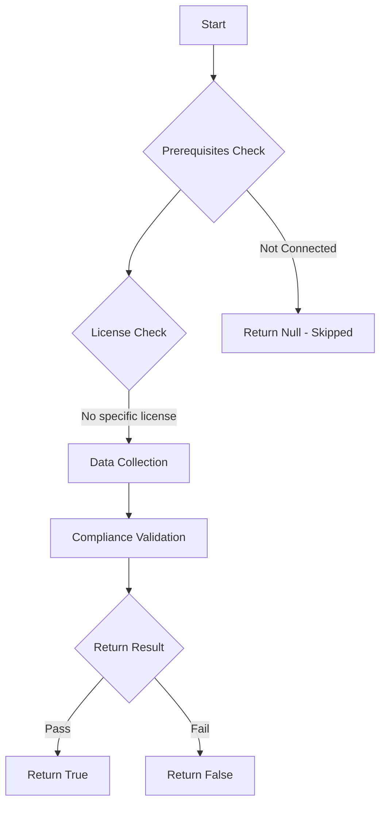

# Test-MtConditionalAccessWhatIf: Tests Conditional Access evaluation with What If for a given scenario.

## Overview

**Function Name:** `Test-MtConditionalAccessWhatIf`
**Category:** Maester/Entra

## Description

This function tests a Conditional Access evaluation with What If for a given scenario.

    The function uses the Microsoft Graph API to evaluate the Conditional Access policies.

    Learn more:
    https://learn.microsoft.com/entra/identity/conditional-access/what-if-tool
    https://learn.microsoft.com/en-us/powershell/module/microsoft.graph.beta.identity.signins/test-mgbetaidentityconditionalaccess?view=graph-powershell-beta

## Workflow

## Phase Details

### Phase 1: Prerequisites Check

No specific prerequisites required.

### Phase 2: Data Collection

**Cmdlets/Functions Used:**
- `Get-MgUser`
- `Invoke-MgGraphRequest`

### Phase 3: Compliance Validation

**Properties Checked:**

| Property | Expected Value |
| --- | --- |
| `policyApplies` | `$true` |

### Phase 4: Return Result

| Return Value | Meaning |
| --- | --- |
| `$true` | Compliant |
| `$false` | Non-Compliant |
| `$null` | Skipped (missing prerequisites, license, or error) |

## Standalone Function

See the standalone compliance check function: [`Test-MtConditionalAccessWhatIfCompliance.ps1`](../../standalone-functions/Maester/Entra/Test-MtConditionalAccessWhatIfCompliance.ps1)
