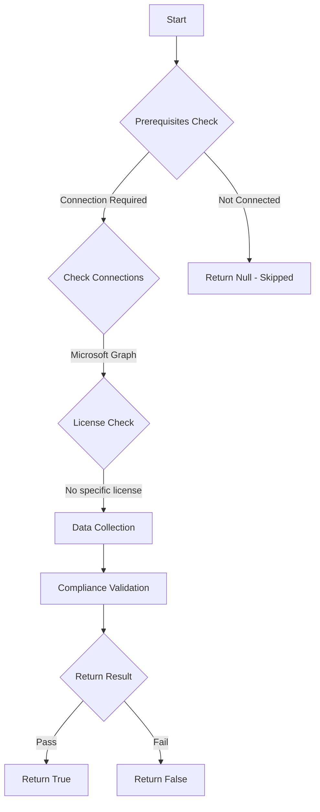

# Test-MtDeviceRegistrationLocalAdminsRegisteringUser: Tests whether registering users are configured as local administrators on devices during Microsoft Entra join.

## Overview

**Function Name:** `Test-MtDeviceRegistrationLocalAdminsRegisteringUser`
**Category:** Maester/Entra

## Description

Registering users should not be added as local administrators on the device during Microsoft Entra join.

## Workflow

## Phase Details

### Phase 1: Prerequisites Check

**Required Connections:**
- Microsoft Graph

### Phase 2: Data Collection

**Graph API Calls:**
- `policies/deviceRegistrationPolicy`

**Cmdlets/Functions Used:**
- `Invoke-MtGraphRequest`

### Phase 3: Compliance Validation

The function validates the collected data against compliance requirements.

### Phase 4: Return Result

| Return Value | Meaning |
| --- | --- |
| `$true` | Compliant |
| `$false` | Non-Compliant |
| `$null` | Skipped (missing prerequisites, license, or error) |

## Original Documentation

The 'Registering user is added as local administrator on the device during Microsoft Entra join' setting determines if the registering user is added to the local administrators group. This setting applies only once during the actual registration of the device as Microsoft Entra join.

#### Remediation action

Within the [Entra Portal - Device Settings](https://entra.microsoft.com/#view/Microsoft_AAD_Devices/DevicesMenuBlade/~/DeviceSettings/menuId/Overview) set _'Registering user is added as local administrator on the device during Microsoft Entra join'_ to *None*.
To remediate existing devices, you need to create an Intune account policy, overriding the built-in Windows Administrators group.

#### Related links

* [Intune - Manage local groups on Windows devices](https://learn.microsoft.com/intune/intune-service/protect/endpoint-security-account-protection-policy#manage-local-groups-on-windows-devices)
* [Microsoft Learn - Device Settings](https://learn.microsoft.com/entra/identity/devices/manage-device-identities#configure-device-settings)

<!--- Results --->
%TestResult%

## Standalone Function

See the standalone compliance check function: [`Test-MtDeviceRegistrationLocalAdminsRegisteringUserCompliance.ps1`](../../standalone-functions/Maester/Entra/Test-MtDeviceRegistrationLocalAdminsRegisteringUserCompliance.ps1)
