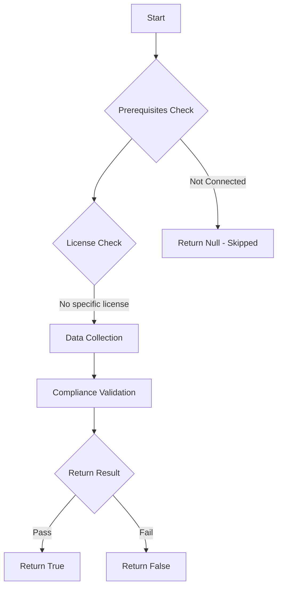

# Maester: Checks if Entra ID Governance access packages or catalogs reference deleted groups

## Overview

**Function Name:** `Test-MtEntitlementManagementDeletedGroups`
**Category:** Maester/Entra
**Test Tag:** `Maester`

## Description

MT.1107 - Access packages and catalogs should not reference deleted groups

    This test identifies access packages and catalogs in Microsoft Entra ID Governance
    that reference Entra ID groups which have been deleted. Deleted group references can cause:
    - Unexpected access provisioning failures
    - Configuration inconsistencies
    - Approval workflow issues
    - Compliance and audit concerns

    The test performs comprehensive checks across:
    - Access package resource assignments (groups assigned as resources)
    - Access package assignment policies (groups configured as approvers)
    - Access package catalog resources (groups registered in catalogs)

    For deleted groups still in the recycle bin, the test retrieves the actual group name
    to provide clear identification of which groups need attention.

    Learn more:
    https://maester.dev/docs/tests/MT.1107

## Workflow

## Phase Details

### Phase 1: Prerequisites Check

No specific prerequisites required.

### Phase 2: Data Collection

**Graph API Calls:**
- `identityGovernance/entitlementManagement/accessPackages/$packageId/assignmentPolicies`
- `identityGovernance/entitlementManagement/accessPackages`
- `identityGovernance/entitlementManagement/accessPackageCatalogs`
- `directory/deletedItems/$groupId`
- `groups/$groupId`
- `identityGovernance/entitlementManagement/accessPackages/$packageId/accessPackageResourceRoleScopes?`$expand=accessPackageResourceScope`
- `identityGovernance/entitlementManagement/accessPackageCatalogs/$($catalog.id)/accessPackageResources`

**Cmdlets/Functions Used:**
- `Invoke-MtGraphRequest`

### Phase 3: Compliance Validation

**Properties Checked:**

| Property | Expected Value |
| --- | --- |
| `Type` | `Access` |
| `Type` | `Catalog` |

### Phase 4: Return Result

| Return Value | Meaning |
| --- | --- |
| `$true` | Compliant |
| `$false` | Non-Compliant |
| `$null` | Skipped (missing prerequisites, license, or error) |

## Original Documentation

## Description

This test identifies Microsoft Entra ID Governance access packages and catalogs that contain references to deleted Entra ID groups. Deleted group references can cause access provisioning failures, broken approval workflows, and compliance violations.

The test validates:
- Groups assigned as resources in access packages still exist
- Groups configured as approvers in assignment policies are active
- Groups registered in catalogs have not been deleted

For any deleted groups found, the test attempts to retrieve the group name from the recycle bin (`directory/deletedItems`) to help identify which groups need attention.

## Remediation action

**Option 1: Remove Deleted Group References**
1. Navigate to [Entra Admin Center → Identity Governance → Access Packages](https://entra.microsoft.com/#view/Microsoft_AAD_ELM/Dashboard.ReactView)
2. For each affected access package:
   - Go to **Resources** and remove the deleted group
   - Update assignment policies to remove deleted group approvers
3. For affected catalogs:
   - Select the catalog → **Resources**
   - Remove the deleted group

**Option 2: Restore Deleted Groups**
1. Navigate to [Entra Admin Center → Identity → Groups → Deleted groups](https://entra.microsoft.com/#blade/Microsoft_AAD_IAM/GroupsManagementMenuBlade/DeletedGroups)
2. Select the deleted group(s) and click **Restore group**
3. Re-run the test to confirm resolution

**Option 3: Replace with Active Groups**
1. Create or identify replacement active groups
2. Add new groups to access packages/catalogs
3. Update assignment policies with new approver groups
4. Remove deleted group references

## Related links

- [Microsoft Entra ID Governance Documentation](https://learn.microsoft.com/entra/id-governance/)
- [Access Packages Overview](https://learn.microsoft.com/entra/id-governance/entitlement-management-access-package-create)
- [Manage Resources in Access Packages](https://learn.microsoft.com/entra/id-governance/entitlement-management-access-package-resources)
- [Access Package Catalogs](https://learn.microsoft.com/entra/id-governance/entitlement-management-catalog-create)
- [Microsoft Graph API - Entitlement Management](https://learn.microsoft.com/graph/api/resources/entitlementmanagement-overview)

## Standalone Function

See the standalone compliance check function: [`Test-MtEntitlementManagementDeletedGroupsCompliance.ps1`](../../standalone-functions/Maester/Entra/Test-MtEntitlementManagementDeletedGroupsCompliance.ps1)
