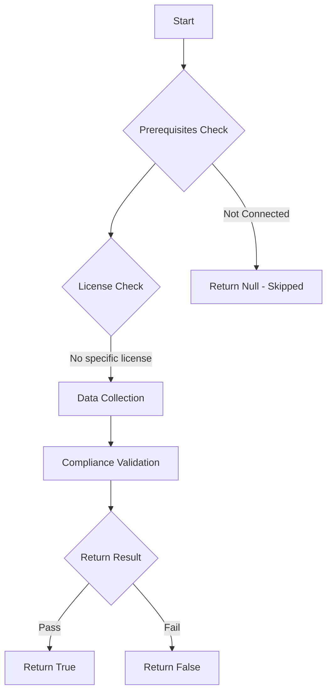

# Maester: Checks if access packages have inactive or orphaned assignment policies

## Overview

**Function Name:** `Test-MtEntitlementManagementInactivePolicies`
**Category:** Maester/Entra
**Test Tag:** `Maester`

## Description

MT.1108 - Access packages should not reference inactive or orphaned assignment policies

    This test identifies Microsoft Entra ID Governance access packages that contain assignment policies
    which are disabled, misconfigured, or orphaned. Inactive policies can cause:
    - Blocked access requests
    - Broken approval workflows
    - Inconsistent user lifecycle automation
    - Configuration drift

    The test validates that all assignment policies are:
    - Accepting requests (requestorSettings.acceptRequests = true)
    - Properly configured with valid scope types
    - Not using deprecated scope types (e.g., "NoSubjects")
    - Have valid approval settings where required
    - Not expired
    - Have proper question configuration

    Learn more:
    https://maester.dev/docs/tests/MT.1108

## Workflow

## Phase Details

### Phase 1: Prerequisites Check

No specific prerequisites required.

### Phase 2: Data Collection

**Graph API Calls:**
- `identityGovernance/entitlementManagement/accessPackages`
- `identityGovernance/entitlementManagement/accessPackageAssignmentPolicies?`$filter=accessPackage/id eq `

**Cmdlets/Functions Used:**
- `Invoke-MtGraphRequest`

### Phase 3: Compliance Validation

**Properties Checked:**

| Property | Expected Value |
| --- | --- |
| `ScopeType` | `Error` |

### Phase 4: Return Result

| Return Value | Meaning |
| --- | --- |
| `$true` | Compliant |
| `$false` | Non-Compliant |
| `$null` | Skipped (missing prerequisites, license, or error) |

## Original Documentation

## Description

This test identifies Microsoft Entra ID Governance access packages that contain assignment policies which are disabled, misconfigured, or orphaned. Inactive or misconfigured policies prevent users from successfully requesting access and can break automated provisioning workflows.

The test validates:
- Policies are in "published" state and active
- Requestor scope type is properly configured (not "NoSubjects" or null)
- Required approval settings are complete with designated approvers
- Policies have not expired
- Required questions have proper text configured

## Remediation action

**For Unpublished Policies:**
1. Navigate to [Entra Admin Center → Identity Governance → Access Packages](https://entra.microsoft.com/#view/Microsoft_AAD_ELM/Dashboard.ReactView)
2. Select the affected access package → **Policies** tab
3. Review the policy state:
   - If should be active: Publish it
   - If no longer needed: Delete it

**For Missing Requestor Settings:**
1. Edit the problematic policy → **Requestor** settings
2. Configure **Who can request** with appropriate scope (All users, Specific users, etc.)
3. Ensure scope type is valid and not deprecated

**For Missing/Invalid Approval Settings:**
1. Edit the policy → **Approval** settings
2. If approval required:
   - Add at least one approval stage
   - Configure primary approvers for each stage
   - Ensure approver groups exist
3. If not required: Disable approval requirement

**For Expired Policies:**
1. Review if expiration was intentional
2. If still needed: Edit policy and update expiration date or remove expiration
3. If no longer needed: Delete the policy

**For Question Configuration Issues:**
1. Edit the policy → **Requestor information** section
2. Ensure all required questions have proper text configured
3. Validate question type and requirements

## Related links

- [Microsoft Entra ID Governance Documentation](https://learn.microsoft.com/entra/id-governance/)
- [Access Package Assignment Policies](https://learn.microsoft.com/entra/id-governance/entitlement-management-access-package-request-policy)
- [Configure Access Package Request Settings](https://learn.microsoft.com/entra/id-governance/entitlement-management-access-package-approval-policy)
- [Microsoft Graph API - Assignment Policies](https://learn.microsoft.com/graph/api/resources/accesspackageassignmentpolicy)

## Standalone Function

See the standalone compliance check function: [`Test-MtEntitlementManagementInactivePoliciesCompliance.ps1`](../../standalone-functions/Maester/Entra/Test-MtEntitlementManagementInactivePoliciesCompliance.ps1)
