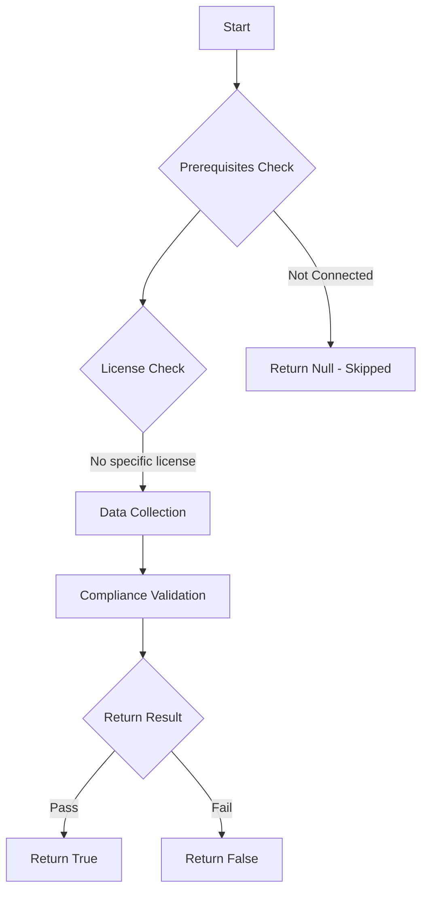

# Maester: Checks if access package approval workflows have valid approvers

## Overview

**Function Name:** `Test-MtEntitlementManagementValidApprovers`
**Category:** Maester/Entra
**Test Tag:** `Maester`

## Description

MT.1109 - Access package approval workflows must have valid approvers

    This test identifies Microsoft Entra ID Governance access package assignment policies with
    approval workflows that reference invalid approvers. Invalid approvers can cause:
    - Approval workflow failures
    - Access request timeouts
    - Broken automation flows
    - User frustration and support tickets

    The test validates that all approval workflows have:
    - Valid user approvers (account enabled, not deleted)
    - Valid group approvers (group exists and has members)
    - Manager approvers where requestor has an assigned manager
    - No references to deleted or disabled accounts

    Learn more:
    https://maester.dev/docs/tests/MT.1109

## Workflow

## Phase Details

### Phase 1: Prerequisites Check

No specific prerequisites required.

### Phase 2: Data Collection

**Graph API Calls:**
- `groups/$groupId/members?`$top=1`
- `users/$userId`
- `identityGovernance/entitlementManagement/accessPackages`
- `identityGovernance/entitlementManagement/accessPackageAssignmentPolicies?`$filter=accessPackage/id eq `
- `groups/$groupId`

**Cmdlets/Functions Used:**
- `Invoke-MtGraphRequest`

### Phase 3: Compliance Validation

The function validates the collected data against compliance requirements.

### Phase 4: Return Result

| Return Value | Meaning |
| --- | --- |
| `$true` | Compliant |
| `$false` | Non-Compliant |
| `$null` | Skipped (missing prerequisites, license, or error) |

## Original Documentation

## Description

This test identifies Microsoft Entra ID Governance access package assignment policies with approval workflows that reference invalid approvers. Invalid approvers cause approval workflow failures, access request timeouts, and create significant operational overhead.

The test validates:
- User approvers exist in the directory and accounts are enabled
- Group approvers exist and have at least one member
- Policies requiring approval have approval stages with primary approvers configured
- Approval workflows are complete and functional

**Note:** Manager approvers are noted but not validated (resolved at request time).

## Remediation action

**For Deleted User Approvers:**
1. Navigate to [Entra Admin Center → Identity Governance → Access Packages](https://entra.microsoft.com/#view/Microsoft_AAD_ELM/Dashboard.ReactView)
2. Select the affected access package → **Policies** tab
3. Edit the affected policy → **Approval** settings
4. Remove deleted users and add valid replacement approvers
5. Consider using groups for resilience
6. Test the approval workflow

**For Disabled User Approvers:**
1. Determine if user should be re-enabled or replaced
2. If temporary: Re-enable the user account in Entra ID
3. If permanent: Replace with active user or group
4. Update policy **Approval** settings

**For Deleted or Missing Groups:**
1. Edit the policy → **Approval** settings
2. Remove references to deleted groups
3. Create or select a valid approval group with active members
4. Update the policy and save

**For Empty Approval Groups:**
1. Navigate to [Entra ID → Groups](https://entra.microsoft.com/#view/Microsoft_AAD_IAM/GroupsManagementMenuBlade)
2. Find the approval group and add appropriate members
3. Ensure multiple members for redundancy
4. Verify the access package policy

**For Missing Approval Stages or Primary Approvers:**
1. Edit the policy → **Approval** settings
2. Add at least one approval stage
3. Configure primary approvers (users, groups, or manager)
4. Set timeout values and save

## Related links

- [Microsoft Entra ID Governance Documentation](https://learn.microsoft.com/entra/id-governance/)
- [Configure Access Package Approval](https://learn.microsoft.com/entra/id-governance/entitlement-management-access-package-approval-policy)
- [Approval Workflow Settings](https://learn.microsoft.com/entra/id-governance/entitlement-management-access-package-request-policy)
- [Microsoft Graph API - Approval Settings](https://learn.microsoft.com/graph/api/resources/approval)

## Standalone Function

See the standalone compliance check function: [`Test-MtEntitlementManagementValidApproversCompliance.ps1`](../../standalone-functions/Maester/Entra/Test-MtEntitlementManagementValidApproversCompliance.ps1)
