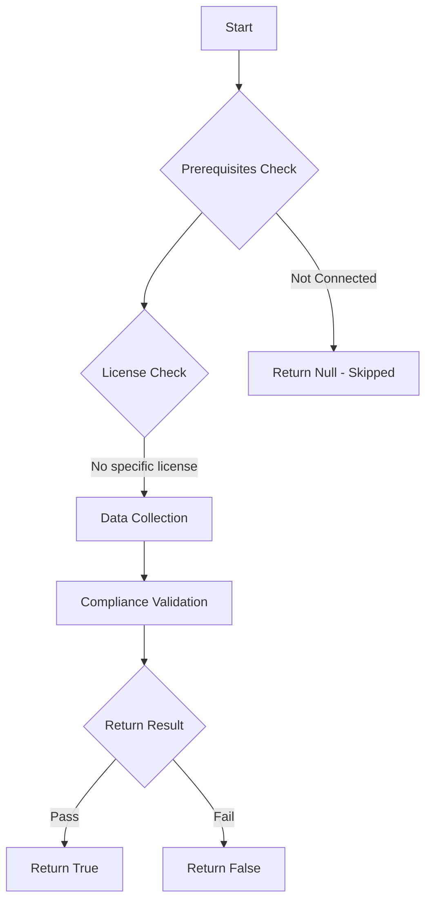

# Test-MtGroupCreationRestricted: Checks if Microsoft 365 Group creation is restricted to approved users.

## Overview

**Function Name:** `Test-MtGroupCreationRestricted`
**Category:** Maester/Entra

## Description

By default, all users can create Microsoft 365 Groups. This can lead to sprawl, security risks and compliance issues.

    Creating groups should be restricted to users who have undergone training and understand the responsibilities of group ownership, governance and compliance requirements.

## Workflow

## Phase Details

### Phase 1: Prerequisites Check

No specific prerequisites required.

### Phase 2: Data Collection

**Graph API Calls:**
- `settings`

**Cmdlets/Functions Used:**
- `Invoke-MtGraphRequest`

### Phase 3: Compliance Validation

**Properties Checked:**

| Property | Expected Value |
| --- | --- |
| `name` | `EnableGroupCreation` |

### Phase 4: Return Result

| Return Value | Meaning |
| --- | --- |
| `$true` | Compliant |
| `$false` | Non-Compliant |
| `$null` | Skipped (missing prerequisites, license, or error) |

## Original Documentation

This test checks if Microsoft 365 Group creation is restricted to approved users.

By default, all users in the tenant can create Microsoft 365 Groups. This can lead to group sprawl, security risks and compliance issues.

Creating groups should be restricted to users who have undergone training and understand the responsibilities of group ownership, governance and compliance requirements.

#### Remediation action

Unfortunately, Microsoft 365 does not provide a user interface to restrict group creation. However, you can restrict group creation to approved users by using PowerShell.

Follow the link below to restrict Microsoft 365 Group creation to approved users:.

#### Related links

- [Manage who can create Microsoft 365 Groups](https://learn.microsoft.com/en-us/microsoft-365/solutions/manage-creation-of-groups?view=o365-worldwide)

<!--- Results --->

%TestResult%

## Standalone Function

See the standalone compliance check function: [`Test-MtGroupCreationRestrictedCompliance.ps1`](../../standalone-functions/Maester/Entra/Test-MtGroupCreationRestrictedCompliance.ps1)
