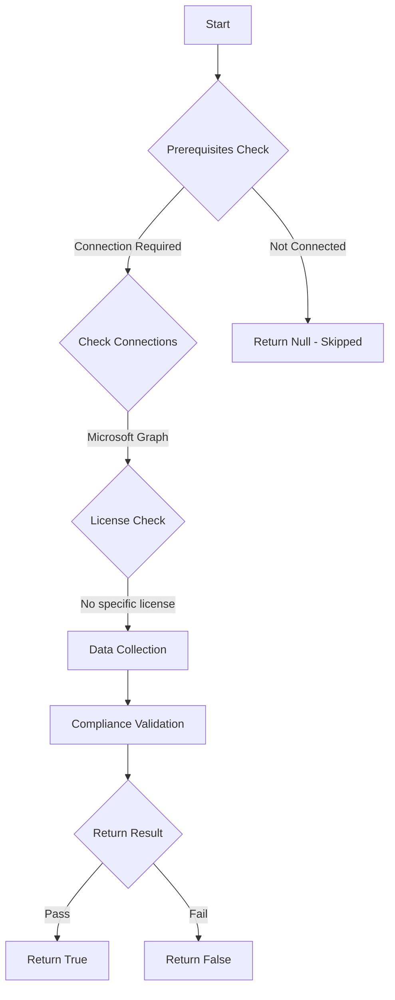

# Test-MtKrbtgtAzureADNotSynced: Ensure krbtgt_AzureAD is not synchronized from on-premises Active Directory.

## Overview

**Function Name:** `Test-MtKrbtgtAzureADNotSynced`
**Category:** Maester/Entra

## Description

The krbtgt_AzureAD account is a sensitive account that should exist only in Entra ID and should not be synchronized from on-premises Active Directory.

## Workflow

## Phase Details

### Phase 1: Prerequisites Check

**Required Connections:**
- Microsoft Graph

### Phase 2: Data Collection

**Graph API Calls:**
- `organization`
- `users`

**Cmdlets/Functions Used:**
- `Invoke-MtGraphRequest`

### Phase 3: Compliance Validation

**Properties Checked:**

| Property | Expected Value |
| --- | --- |
| `onPremisesDistinguishedName` | `(?i)(^|,)CN=krbtgt_AzureAD,` |

### Phase 4: Return Result

| Return Value | Meaning |
| --- | --- |
| `$true` | Compliant |
| `$false` | Non-Compliant |
| `$null` | Skipped (missing prerequisites, license, or error) |

## Original Documentation

Ensure krbtgt_AzureAD is not synchronized from on-premises Active Directory.

The krbtgt_AzureAD account is a sensitive identity used by Microsoft's cloud services for Microsoft Entra Kerberos scenarios. Microsoft recommends keeping a clear separation between cloud and on-premises environments and not synchronizing this account to Entra ID. Synchronizing an on-premises krbtgt_AzureAD account creates an unnecessary privilege escalation path between the environments.

#### Remediation action:

1. Review your Microsoft Entra Connect synchronization scope and identify the on-premises krbtgt_AzureAD account.
2. Exclude that account from synchronization, for example by OU filtering or domain filtering, so it is not synced to Entra ID.
3. Run a synchronization cycle and confirm that no synchronized krbtgt_AzureAD account remains in Entra ID.

#### Related links

* [Security considerations for Microsoft Entra Kerberos | Microsoft Learn](https://learn.microsoft.com/en-us/entra/identity/authentication/kerberos#security-considerations)
* [Microsoft Entra Connect Sync: Configure filtering | Microsoft Learn](https://learn.microsoft.com/en-us/entra/identity/hybrid/connect/how-to-connect-sync-configure-filtering)
* [Microsoft Entra admin center - Microsoft Entra Connect](https://entra.microsoft.com/#view/Microsoft_AAD_Connect_Provisioning/AADConnectMenuBlade/~/ConnectSync)

<!--- Results --->
%TestResult%

## Standalone Function

See the standalone compliance check function: [`Test-MtKrbtgtAzureADNotSyncedCompliance.ps1`](../../standalone-functions/Maester/Entra/Test-MtKrbtgtAzureADNotSyncedCompliance.ps1)
