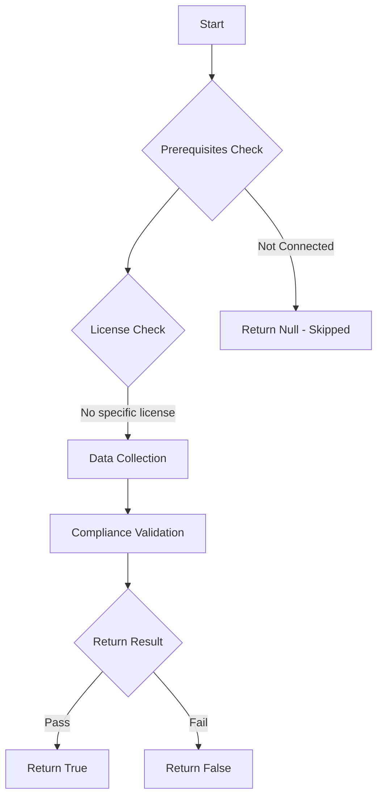

# Test-MtPimAlertsExists: 

## Overview

**Function Name:** `Test-MtPimAlertsExists`
**Category:** Maester/Entra

## Description

## Workflow

## Phase Details

### Phase 1: Prerequisites Check

No specific prerequisites required.

### Phase 2: Data Collection

**Cmdlets/Functions Used:**
- `Get-MtUser`
- `Get-MgContext`
- `Invoke-MtGraphRequest`
- `Invoke-WebRequest`

### Phase 3: Compliance Validation

**Properties Checked:**

| Property | Expected Value |
| --- | --- |
| `isActive` | `True` |

### Phase 4: Return Result

| Return Value | Meaning |
| --- | --- |
| `$true` | Compliant |
| `$false` | Non-Compliant |
| `$null` | Skipped (missing prerequisites, license, or error) |

## Standalone Function

See the standalone compliance check function: [`Test-MtPimAlertsExistsCompliance.ps1`](../../standalone-functions/Maester/Entra/Test-MtPimAlertsExistsCompliance.ps1)
