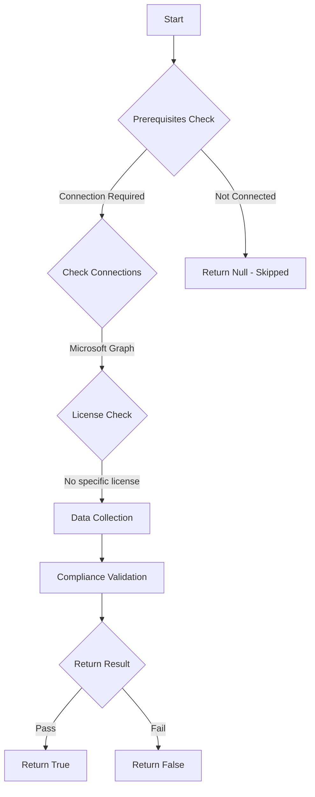

# Entra: Tests if security group creation is restricted to admin users.

## Overview

**Function Name:** `Test-MtSecurityGroupCreationRestricted`
**Category:** Maester/Entra
**Test Tag:** `Entra`

## Description

This function checks if security group creation is restricted to admin users by querying the authorization policy settings.

## Workflow



## Phase Details

### Phase 1: Prerequisites Check

**Required Connections:**
- Microsoft Graph

### Phase 2: Data Collection

**Graph API Calls:**
- `policies/authorizationPolicy?$select=defaultUserRolePermissions`

**Cmdlets/Functions Used:**
- `Invoke-MtGraphRequest`

### Phase 3: Compliance Validation

The function validates the collected data against compliance requirements.

### Phase 4: Return Result

| Return Value | Meaning |
| --- | --- |
| `$true` | Compliant |
| `$false` | Non-Compliant |
| `$null` | Skipped (missing prerequisites, license, or error) |

## Original Documentation

## Description

Verifies that security group creation is restricted to admin users only in the Entra ID tenant.

## Why This Matters

Restricting security group creation to administrators ensures proper governance, maintains the principle of least privilege, and supports regulatory compliance requirements.

#### Remediation action

This setting can be changed via user settings in the Microsoft Entra or Azure portal or via Microsoft Graph API / Graph PowerShell Module.

Admin Portal:

1. Go to [Entra Admin Center](https://entra.microsoft.com)
2. Navigate to Users → [User settings](https://entra.microsoft.com/#view/Microsoft_AAD_UsersAndTenants/UserManagementMenuBlade/~/UserSettings/menuId/)
3. Set **Users can create security groups** to **No**
4. Click **Save**

Use the following PowerShell commands to restrict security group creation:

```powershell
# Connect to Microsoft Graph with appropriate permissions
Connect-MgGraph -Scopes "Policy.ReadWrite.Authorization"

# Get the current authorization policy
$authPolicy = Get-MgPolicyAuthorizationPolicy

# Update the policy to restrict security group creation
$params = @{
    defaultUserRolePermissions = @{
        allowedToCreateSecurityGroups = $false
    }
}

Update-MgPolicyAuthorizationPolicy -AuthorizationPolicyId $authPolicy.Id -BodyParameter $params
```

#### Related links

- [Manage default user permissions in Entra ID](https://learn.microsoft.com/en-us/azure/active-directory/fundamentals/users-default-permissions)
- [Authorization policy in Entra ID](https://learn.microsoft.com/en-us/graph/api/resources/authorizationpolicy)

## Standalone Function

See the standalone compliance check function: [`Test-MtSecurityGroupCreationRestrictedCompliance.ps1`](../../standalone-functions/Maester/Entra/Test-MtSecurityGroupCreationRestrictedCompliance.ps1)
