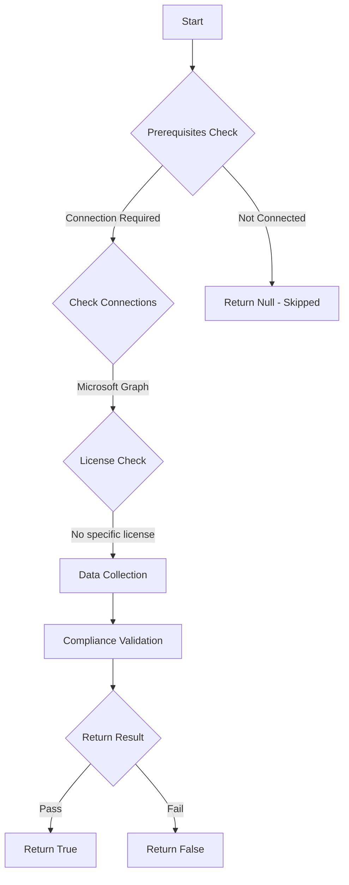

# Test-MtServicePrincipalsForAllUsers: This test checks if you have any third party service principals that are open to all users. It is recommended to set 'Assignment required?' to Yes for all Third Party apps.

## Overview

**Function Name:** `Test-MtServicePrincipalsForAllUsers`
**Category:** Maester/Entra

## Description

Open all app service principals below and set 'Assignment required?' to Yes. Assign users under 'Users and groups' to provide them with explicit access. If desired, use the audit logs per SPN to determine who was using the application before locking them down.

## Workflow

## Phase Details

### Phase 1: Prerequisites Check

**Required Connections:**
- Microsoft Graph

### Phase 2: Data Collection

**Cmdlets/Functions Used:**
- `Invoke-MtGraphRequest`

### Phase 3: Compliance Validation

The function validates the collected data against compliance requirements.

### Phase 4: Return Result

| Return Value | Meaning |
| --- | --- |
| `$true` | Compliant |
| `$false` | Non-Compliant |
| `$null` | Skipped (missing prerequisites, license, or error) |

## Original Documentation

This test checks if you have any third party service principals that are open to all users. It is recommended to set 'Assignment required?' to Yes for all Third Party apps.

#### Remediation action

Open all app service principals below and set 'Assignment required?' to Yes. Assign users under 'Users and groups' to provide them with explicit access. If desired, use the audit logs per SPN to determine who was using the application before locking them down.

<!--- Results --->

%TestResult%

## Standalone Function

See the standalone compliance check function: [`Test-MtServicePrincipalsForAllUsersCompliance.ps1`](../../standalone-functions/Maester/Entra/Test-MtServicePrincipalsForAllUsersCompliance.ps1)
