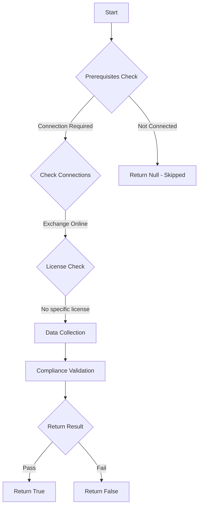

# Test-MtSpExchangeAppAccessPolicy: Check if service principals with Exchange permissions have application access policies configured.

## Overview

**Function Name:** `Test-MtSpExchangeAppAccessPolicy`
**Category:** Maester/Entra

## Description

Service principals with Exchange permissions can access all mailboxes by default. This test verifies that proper access policies are in place.

## Workflow



## Phase Details

### Phase 1: Prerequisites Check

**Required Connections:**
- Exchange Online

### Phase 2: Data Collection

**Graph API Calls:**
- `servicePrincipals/$($sp.Id)/appRoleAssignments`
- `servicePrincipals`

**Cmdlets/Functions Used:**
- `Invoke-MtGraphRequest`
- `Get-ApplicationAccessPolicy`
- `Get-MtLinkServicePrincipal`

### Phase 3: Compliance Validation

**Properties Checked:**

| Property | Expected Value |
| --- | --- |
| `Id` | `$roleId` |

### Phase 4: Return Result

| Return Value | Meaning |
| --- | --- |
| `$true` | Compliant |
| `$false` | Non-Compliant |
| `$null` | Skipped (missing prerequisites, license, or error) |

## Original Documentation

Application access policies in Exchange Online help you control which applications can access which mailboxes.

Without these policies, applications with Exchange permissions can access all mailboxes in your organization.

Microsoft Exchange related permissions that should be secured by application access policies include:

- Mail.Read
- Mail.ReadBasic
- Mail.ReadBasic.All
- Mail.ReadWrite
- Mail.Send
- MailboxSettings.Read
- MailboxSettings.ReadWrite
- Calendars.Read
- Calendars.ReadWrite
- Contacts.Read
- Contacts.ReadWrite

Exchange application access policies should be configured for all applications with Exchange permissions.

### Remediation action

Follow the steps below to create an application access policy in Exchange Online that restricts the application's access to mailboxes in a specific distribution group.

#### Connect to Exchange Online

```powershell
Connect-ExchangeOnline
```

#### Define variables for your application

```powershell
# Get these values from your Application Registration
$AppID = "<your-app-id>"  # e.g. "0a3ad682-b031-416d-86c2-bf263f8b46a3"
$GroupName = "AAP_$AppID"  # example naming convention for clarity
$Description = "Restrict this app to members of distribution group"
```

#### Create a mail-enabled security group for policy scope

```powershell
# Create group and hide from address list
$DGroup = New-DistributionGroup -Name $GroupName -Type Security
Start-Sleep -Seconds 5  # Wait for group creation to propagate
Set-DistributionGroup -Identity $DGroup.WindowsEmailAddress -HiddenFromAddressListsEnabled $true
```

#### Create the application access policy

```powershell
New-ApplicationAccessPolicy -AppId $AppID `
                          -PolicyScopeGroupId $DGroup.WindowsEmailAddress `
                          -AccessRight RestrictAccess `
                          -Description $Description
```

#### Add members to the security group

```powershell
Add-DistributionGroupMember -Identity $GroupName -Member user@contoso.com
```

#### Verify the policy

```powershell
# List all policies
Get-ApplicationAccessPolicy

# Test for specific user
Test-ApplicationAccessPolicy -Identity user@contoso.com -AppId $AppID
```

<!--- Results --->
%TestResult%

## Standalone Function

See the standalone compliance check function: [`Test-MtSpExchangeAppAccessPolicyCompliance.ps1`](../../standalone-functions/Maester/Entra/Test-MtSpExchangeAppAccessPolicyCompliance.ps1)
