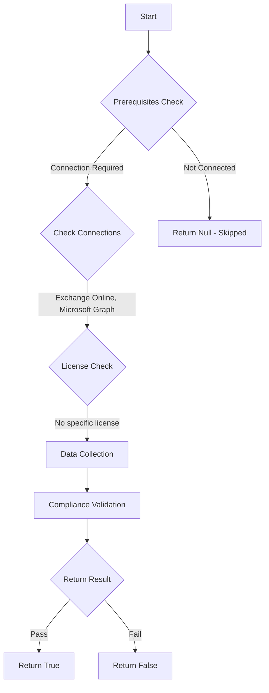

# Test-MtExoDelicensingResiliency: Checks if Delicensing Resiliency is enabled in Exchange Online

## Overview

**Function Name:** `Test-MtExoDelicensingResiliency`
**Category:** Maester/Exchange

## Description

Delicensing Resiliency should be enabled to maintain access to mailboxes
    when licenses are removed, providing a grace period before access is lost.
    This helps prevent immediate disruption when licenses expire or are reassigned.

## Workflow



## Phase Details

### Phase 1: Prerequisites Check

**Required Connections:**
- Exchange Online
- Microsoft Graph

### Phase 2: Data Collection

**Exchange Online Requests:**
- `OrganizationConfig`

### Phase 3: Compliance Validation

The function validates the collected data against compliance requirements.

### Phase 4: Return Result

| Return Value | Meaning |
| --- | --- |
| `$true` | Compliant |
| `$false` | Non-Compliant |
| `$null` | Skipped (missing prerequisites, license, or error) |

## Original Documentation

> **Important:** This test is only available if your tenant has at least **5000 non-trial Exchange Online licenses**.

Delicensing Resiliency SHOULD be enabled to maintain access to mailboxes when licenses are removed.


#### Remediation action:

Enable Delicensing Resiliency by running the following PowerShell command in Exchange Online:

```powershell
Set-OrganizationConfig -DelayedDelicensingEnabled:$true
```

##### Optional: Configure User Notifications

You can also configure notifications to inform administrators and end users about delicensing events:

```powershell
# Enable tenant admin notifications for delicensing events
Set-OrganizationConfig -TenantAdminNotificationForDelayedDelicensingEnabled:$true

# Enable end user mail notifications for delicensing events
Set-OrganizationConfig -EndUserMailNotificationForDelayedDelicensingEnabled:$true
```

**Note**: These notification settings help ensure stakeholders are informed when licensing changes occur that could affect mailbox access.

#### Related links

* [Delayed Delicensing in Exchange Online](https://learn.microsoft.com/en-us/Exchange/recipients-in-exchange-online/manage-user-mailboxes/exchange-online-delicensing-resiliency)
* [Set-OrganizationConfig](https://docs.microsoft.com/en-us/powershell/module/exchange/set-organizationconfig)

<!--- Results --->
%TestResult%

## Standalone Function

See the standalone compliance check function: [`Test-MtExoDelicensingResiliencyCompliance.ps1`](../../standalone-functions/Maester/Exchange/Test-MtExoDelicensingResiliencyCompliance.ps1)
