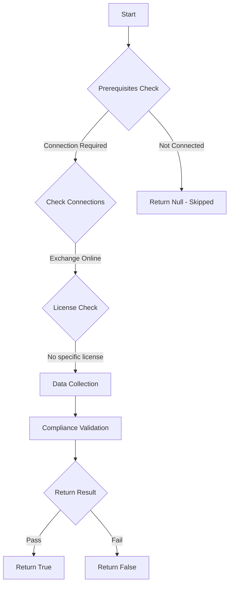

# Test-MtExoMailTip: Checks if MailTips are enabled for end users

## Overview

**Function Name:** `Test-MtExoMailTip`
**Category:** Maester/Exchange

## Description

MailTips assist end users with identifying strange patterns to emails they send.
    This helps protect against accidental information disclosure and phishing attempts.

## Workflow



## Phase Details

### Phase 1: Prerequisites Check

**Required Connections:**
- Exchange Online

### Phase 2: Data Collection

**Exchange Online Requests:**
- `OrganizationConfig`

### Phase 3: Compliance Validation

The function validates the collected data against compliance requirements.

### Phase 4: Return Result

| Return Value | Meaning |
| --- | --- |
| `$true` | Compliant |
| `$false` | Non-Compliant |
| `$null` | Skipped (missing prerequisites, license, or error) |

## Original Documentation

MailTips SHOULD be enabled for end users

Rationale: MailTips assist end users with identifying strange patterns in emails they send, helping prevent accidental data leakage and improving overall email security awareness.

#### Remediation action:

1. Connect to Exchange Online:
```powershell
Connect-ExchangeOnline
```

2. Enable MailTips for external recipients:
```powershell
Set-OrganizationConfig -MailTipsExternalRecipientsTipsEnabled $true
```

3. Verify the setting:
```powershell
(Get-OrganizationConfig).MailTipsExternalRecipientsTipsEnabled
```
The result should be `True`.

#### Related links

* [MailTips in Exchange Online](https://learn.microsoft.com/en-us/exchange/clients-and-mobile-in-exchange-online/mailtips/mailtips)
* [Microsoft Secure Score - Enable MailTips](https://security.microsoft.com/securescore)

<!--- Results --->
%TestResult%

## Standalone Function

See the standalone compliance check function: [`Test-MtExoMailTipCompliance.ps1`](../../standalone-functions/Maester/Exchange/Test-MtExoMailTipCompliance.ps1)
