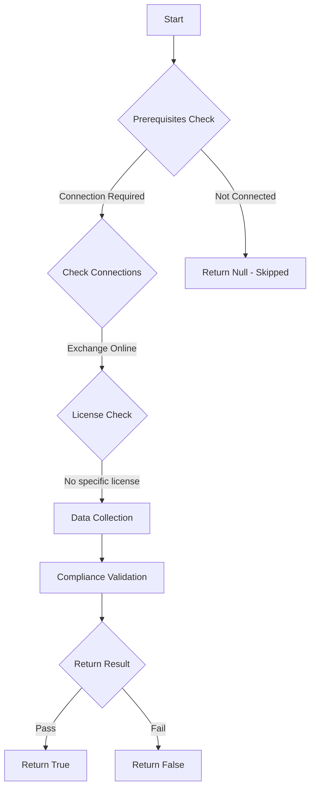

# Test-MtExoModernAuth: Checks if modern authentication for Exchange Online is enabled

## Overview

**Function Name:** `Test-MtExoModernAuth`
**Category:** Maester/Exchange

## Description

Modern authentication in Microsoft 365 enables authentication features like multifactor
    authentication (MFA) using smart cards, certificate-based authentication (CBA), and
    third-party SAML identity providers.

## Workflow



## Phase Details

### Phase 1: Prerequisites Check

**Required Connections:**
- Exchange Online

### Phase 2: Data Collection

**Exchange Online Requests:**
- `OrganizationConfig`

### Phase 3: Compliance Validation

The function validates the collected data against compliance requirements.

### Phase 4: Return Result

| Return Value | Meaning |
| --- | --- |
| `$true` | Compliant |
| `$false` | Non-Compliant |
| `$null` | Skipped (missing prerequisites, license, or error) |

## Original Documentation

Modern authentication for Exchange Online MUST be enabled

Rationale: Modern authentication enables enhanced security features like multifactor authentication (MFA), certificate-based authentication (CBA), and third-party SAML identity providers. Without modern authentication, users are more vulnerable to password-based attacks.

#### Remediation action:

1. Connect to Exchange Online:
```powershell
Connect-ExchangeOnline
```

2. Enable modern authentication:
```powershell
Set-OrganizationConfig -OAuth2ClientProfileEnabled $true
```

3. Verify the setting:
```powershell
(Get-OrganizationConfig).OAuth2ClientProfileEnabled
```
The result should be `True`.

#### Related links

* [Enable or disable modern authentication in Exchange Online](https://learn.microsoft.com/en-us/exchange/clients-and-mobile-in-exchange-online/enable-or-disable-modern-authentication-in-exchange-online)
* [Modern authentication overview](https://learn.microsoft.com/en-us/microsoft-365/enterprise/modern-auth-for-office-2013-and-2016)
* [Microsoft Secure Score - Enable modern authentication](https://security.microsoft.com/securescore)

<!--- Results --->
%TestResult%

## Standalone Function

See the standalone compliance check function: [`Test-MtExoModernAuthCompliance.ps1`](../../standalone-functions/Maester/Exchange/Test-MtExoModernAuthCompliance.ps1)
